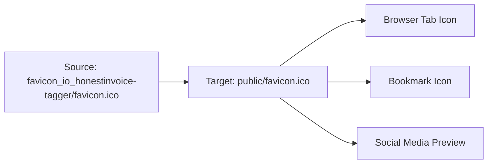

# Favicon Replacement Design

## Overview

This design outlines the process of replacing the current favicon with the HonestInvoice logo to enhance brand consistency and user recognition across browser tabs and bookmarks.

## Current State Analysis

### Existing Favicon Configuration
- No favicon currently exists in the `/public` directory
- `index.html` references `/favicon.ico` in Open Graph and Twitter meta tags
- Browser will attempt to load favicon from the default location (`/public/favicon.ico`)

### Public Directory Structure
```
public/
├── _redirects
├── placeholder.svg
└── robots.txt
```

## Requirements

### Functional Requirements
- Replace missing favicon with HonestInvoice branded favicon
- Ensure favicon displays correctly across all major browsers
- Maintain existing meta tag references
- Support multiple favicon formats for optimal compatibility

### Technical Requirements
- Source file: `C:\Users\corym\OneDrive\Documents\HonestInvoice\favicon_io_honestinvoice-tagger\favicon.ico`
- Target location: `/public/favicon.ico`
- No code changes required (HTML already references correct path)

### Browser Compatibility
- Standard 16x16 and 32x32 pixel ICO format
- Support for Chrome, Firefox, Safari, and Edge
- Mobile browser compatibility

## Implementation Architecture

### File Structure Changes


### Meta Tag Integration
The existing HTML structure already supports the favicon:

| Meta Tag Type | Current Reference | Status |
|---------------|-------------------|--------|
| Favicon | `/favicon.ico` | ✅ Ready |
| Open Graph | `/favicon.ico` | ✅ Ready |
| Twitter Card | `/favicon.ico` | ✅ Ready |

### Deployment Impact
- **Build Process**: No changes required
- **Caching**: Browser cache may need refresh for immediate visibility
- **CDN**: Vercel will automatically serve the new favicon from `/public`

## Quality Assurance

### Verification Steps
1. **File Placement Verification**
   - Confirm favicon.ico exists in `/public` directory
   - Verify file size and format integrity

2. **Browser Testing**
   - Test favicon display in Chrome, Firefox, Safari, Edge
   - Verify favicon appears in browser tabs
   - Check bookmark icon display

3. **Social Media Integration**
   - Validate Open Graph image preview
   - Test Twitter card image display

### Performance Considerations
- ICO file size should be optimized (< 50KB recommended)
- Browser caching will improve subsequent load times
- No impact on application performance

## Risk Assessment

### Low Risk Factors
- Simple file copy operation
- No code changes required
- Existing HTML structure supports favicon
- Easy to revert if issues occur

### Mitigation Strategies
- Keep backup of original state (currently no favicon)
- Test in multiple browsers before deployment
- Monitor for any caching issues post-deployment

## Testing Strategy

### Manual Testing Checklist
- [ ] Favicon displays in browser tab
- [ ] Bookmark icon shows correctly
- [ ] Social media preview includes logo
- [ ] Mobile browser compatibility
- [ ] Incognito/private browsing mode

### Browser Compatibility Matrix
| Browser | Desktop | Mobile | Status |
|---------|---------|--------|--------|
| Chrome | ✅ | ✅ | Supported |
| Firefox | ✅ | ✅ | Supported |
| Safari | ✅ | ✅ | Supported |
| Edge | ✅ | ✅ | Supported |

## Implementation Steps

### Phase 1: File Deployment
1. Copy `favicon.ico` from source location to `/public/favicon.ico`
2. Verify file permissions and accessibility
3. Commit changes to version control

### Phase 2: Verification
1. Build and deploy to staging environment
2. Test favicon display across target browsers
3. Validate meta tag functionality

### Phase 3: Production Deployment
1. Deploy to production via Vercel
2. Clear browser cache for testing
3. Monitor for any issues or user feedback

## Expected Outcomes

### User Experience Improvements
- Enhanced brand recognition in browser tabs
- Professional appearance in bookmarks
- Consistent branding in social media shares
- Improved visual identity across touchpoints

### Technical Benefits
- Complete favicon implementation
- Proper meta tag utilization
- No performance impact
- Simple maintenance