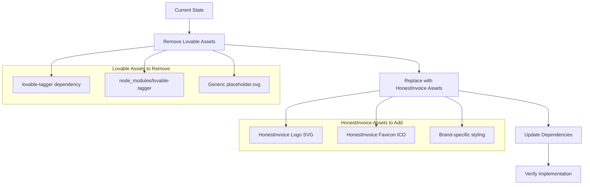
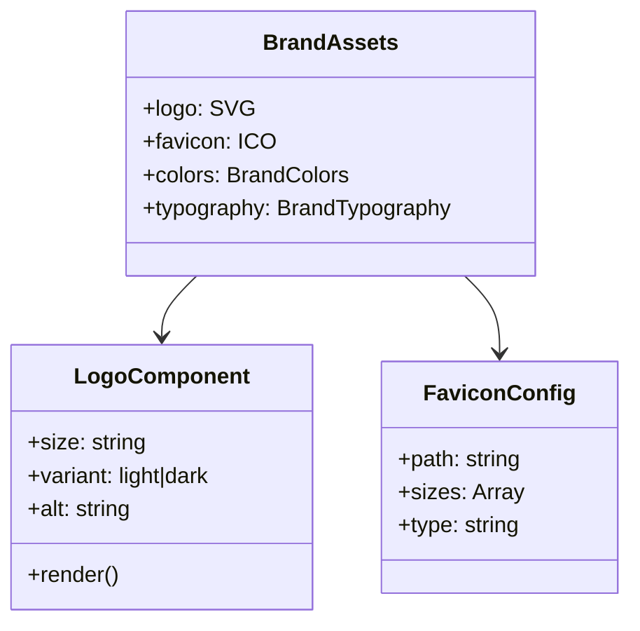

# Replace Lovable Branding with HonestInvoice Logo Design

## Overview

This design outlines the comprehensive process of removing all Lovable branding from the HonestInvoice codebase and replacing it with proper HonestInvoice branding assets. The goal is to achieve complete brand consistency and remove any third-party branding references.

## Current State Analysis

### Identified Lovable References

#### Dependencies
- **lovable-tagger**: Development dependency in `package.json` (version 1.1.9)
- **Node modules**: Entire `node_modules/lovable-tagger` directory with build tools

#### Visual Assets
- **placeholder.svg**: Generic placeholder image in `/public` directory
- **favicon.ico**: Attached HonestInvoice favicon needs to replace current missing favicon
- **dist/favicon.ico**: Existing favicon file that should be updated

#### Branding Elements
- **App.css**: Contains generic logo styling that may reference Lovable patterns
- **Meta tags**: HTML references `/favicon.ico` for social media previews

### Current Directory Structure
```
public/
├── _redirects
├── placeholder.svg        # Generic placeholder - replace with HonestInvoice logo
└── robots.txt

dist/
└── favicon.ico           # Update with HonestInvoice favicon

src/
├── App.css              # Contains logo styling
└── pages/dashboard/
    └── CustomBranding.tsx # Branding customization component
```

## Technology Stack Analysis

**Frontend Framework**: React 18.3.1 with Vite 5.4.19
**Styling**: Tailwind CSS with shadcn-ui components
**Build System**: Vite with TypeScript support
**Package Manager**: npm with package-lock.json

## Requirements

### Functional Requirements
- Remove all Lovable branding references from codebase
- Replace generic placeholder assets with HonestInvoice branding
- Update favicon to HonestInvoice logo
- Ensure brand consistency across all touchpoints
- Maintain existing functionality and performance

### Technical Requirements
- Remove `lovable-tagger` dependency from package.json
- Replace placeholder.svg with HonestInvoice logo SVG
- Update favicon.ico with provided HonestInvoice favicon
- Clean up any unused logo styling in App.css
- Ensure proper meta tag references for social media

### Compliance Requirements
- Remove all third-party branding to avoid trademark issues
- Establish clear HonestInvoice brand identity
- Ensure professional appearance across all assets

## Architecture Design

### Asset Replacement Strategy



### File Modification Plan

| File | Action | Description |
|------|--------|-------------|
| `package.json` | Remove | Delete `lovable-tagger` from devDependencies |
| `package-lock.json` | Update | Remove all lovable-tagger references |
| `public/placeholder.svg` | Replace | Replace with HonestInvoice logo SVG |
| `dist/favicon.ico` | Replace | Update with provided HonestInvoice favicon |
| `public/favicon.ico` | Add | Add HonestInvoice favicon to public directory |
| `src/App.css` | Review | Clean up generic logo styles if needed |
| `node_modules/lovable-tagger/` | Remove | Delete entire directory |

### Brand Asset Integration

#### Logo Implementation
- **SVG Format**: Scalable vector graphics for crisp display at all sizes
- **Responsive Design**: Proper sizing for different screen resolutions
- **Color Variants**: Support for light/dark theme compatibility
- **Accessibility**: Alt text and proper semantic markup

#### Favicon Strategy
- **ICO Format**: Multi-resolution favicon.ico for broad browser support
- **Placement**: Both `/public/favicon.ico` and `/dist/favicon.ico`
- **Meta Tag Optimization**: Ensure proper Open Graph and Twitter Card integration

## Component Architecture

### Brand Asset Component Structure



### CustomBranding Integration
The existing `CustomBranding.tsx` component will benefit from:
- Consistent brand asset references
- Improved logo URL validation
- Enhanced preview functionality with HonestInvoice branding

## Implementation Strategy

### Phase 1: Dependency Cleanup
1. **Remove lovable-tagger dependency**
   - Update package.json
   - Run npm install to update package-lock.json
   - Delete node_modules/lovable-tagger directory

2. **Clean up package-lock.json**
   - Remove all lovable-tagger references
   - Ensure lockfile integrity

### Phase 2: Asset Replacement
1. **Replace placeholder.svg**
   - Create HonestInvoice logo SVG
   - Optimize for web performance
   - Ensure accessibility compliance

2. **Update favicon assets**
   - Replace dist/favicon.ico
   - Add public/favicon.ico
   - Verify meta tag references

### Phase 3: Code Cleanup
1. **Review App.css**
   - Remove generic logo animations if Lovable-specific
   - Update logo styling for HonestInvoice branding
   - Ensure responsive design

2. **Update component references**
   - Check CustomBranding component for improvements
   - Ensure logo previews work correctly

### Phase 4: Testing & Verification
1. **Build verification**
   - Ensure clean build without lovable-tagger
   - Verify asset loading
   - Test favicon display

2. **Brand consistency check**
   - Verify logo display across components
   - Test social media meta tag previews
   - Validate responsive behavior

## File Structure Changes

### Before
```
public/
├── placeholder.svg       # Generic placeholder
└── robots.txt

package.json             # Contains lovable-tagger
node_modules/
└── lovable-tagger/      # Third-party branding tool
```

### After
```
public/
├── honestinvoice-logo.svg  # HonestInvoice branded logo
├── favicon.ico             # HonestInvoice favicon
└── robots.txt

package.json               # Clean dependencies
node_modules/              # No lovable-tagger
```

## Performance Considerations

### Asset Optimization
- **SVG Optimization**: Minimize file size while maintaining quality
- **Favicon Efficiency**: Use appropriate ICO compression
- **Caching Strategy**: Ensure proper browser caching for static assets

### Build Performance
- **Dependency Reduction**: Removing lovable-tagger reduces build dependencies
- **Bundle Size**: Smaller dependency tree improves build times
- **Memory Usage**: Reduced node_modules size

## Security Considerations

### Third-Party Risk Reduction
- **Dependency Reduction**: Fewer third-party packages reduce attack surface
- **Brand Protection**: Remove potential trademark issues
- **Supply Chain Security**: Eliminate unnecessary development tools

### Asset Security
- **File Integrity**: Ensure all brand assets are authentic HonestInvoice materials
- **Access Control**: Proper file permissions for public assets

## Quality Assurance

### Testing Checklist
- [ ] Remove lovable-tagger from package.json
- [ ] Verify clean npm install without errors
- [ ] Replace placeholder.svg with HonestInvoice logo
- [ ] Update favicon.ico in both public and dist directories
- [ ] Test logo display in CustomBranding component
- [ ] Verify favicon appears in browser tabs
- [ ] Check social media meta tag previews
- [ ] Validate responsive logo behavior
- [ ] Ensure build process completes successfully
- [ ] Test dark/light theme compatibility

### Brand Consistency Validation
- [ ] Logo displays correctly across all screen sizes
- [ ] Favicon matches brand guidelines
- [ ] Color scheme aligns with HonestInvoice branding
- [ ] Typography remains consistent
- [ ] No remaining Lovable references in codebase

### Browser Compatibility
- [ ] Favicon displays in Chrome, Firefox, Safari, Edge
- [ ] SVG logo renders correctly across browsers
- [ ] Meta tag previews work on social platforms
- [ ] Mobile browser compatibility verified

## Risk Assessment

### Low Risk Factors
- Asset replacement is straightforward file operations
- Dependency removal has minimal impact on core functionality
- Existing functionality remains unchanged
- Easy to revert if issues occur

### Mitigation Strategies
- Backup current assets before replacement
- Test build process thoroughly before deployment
- Validate brand assets meet quality standards
- Monitor for any missing asset references post-deployment

## Expected Outcomes

### Brand Improvements
- Complete removal of third-party branding
- Consistent HonestInvoice brand identity
- Professional appearance across all touchpoints
- Enhanced brand recognition

### Technical Benefits
- Reduced dependency footprint
- Cleaner build process
- Improved asset organization
- Better maintainability

### User Experience Enhancements
- Consistent visual identity
- Professional favicon in browser tabs
- Proper social media sharing previews
- Enhanced brand trust and recognition