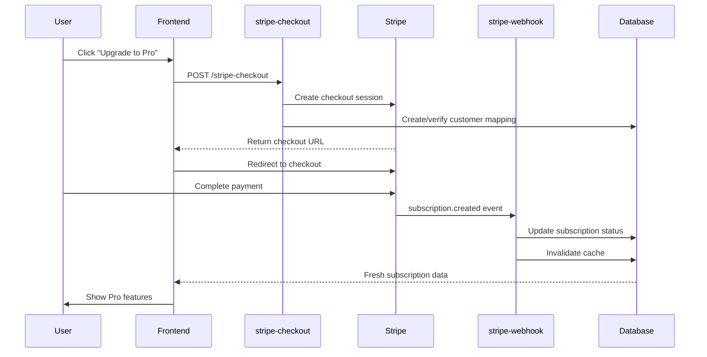

# Stripe Integration Test Suite Design

## Overview

This document outlines a comprehensive testing strategy for verifying all components of the HonestInvoice Stripe integration system. The test suite ensures proper functionality across database schemas, Supabase Edge Functions, webhook validation, subscription synchronization, and Pro feature access control.

## Test Architecture

```mermaid
graph TD
    A[Test Suite Entry Point] --> B[Database Component Tests]
    A --> C[Environment Configuration Tests]
    A --> D[Stripe Setup Tests]
    A --> E[Supabase Function Tests]
    A --> F[Webhook Validation Tests]
    A --> G[Subscription Flow Tests]
    A --> H[End-to-End Integration Tests]
    
    B --> B1[Schema Verification]
    B --> B2[RLS Policy Testing]
    B --> B3[Custom Functions Testing]
    
    C --> C1[Local Environment Validation]
    C --> C2[Supabase Environment Validation]
    C --> C3[Stripe Configuration Validation]
    
    D --> D1[Pro Product Creation]
    D --> D2[Feature Entitlements Setup]
    D --> D3[Price Configuration]
    
    E --> E1[stripe-checkout Function]
    E --> E2[stripe-webhook Function]
    E --> E3[Function Authentication]
    
    F --> F1[Signature Verification]
    F --> F2[Event Processing]
    F --> F3[Error Handling]
    
    G --> G1[Status Synchronization]
    G --> G2[Cache Invalidation]
    G --> G3[Pro Access Control]
    
    H --> H1[Complete Checkout Flow]
    H --> H2[Feature Activation]
    H --> H3[User Experience Validation]
```



## Database Component Testing

### Schema Verification Tests

**Test ID: DB-001**
- **Objective**: Verify all required Stripe-related database tables exist and are accessible
- **Tables to Validate**:
  - `stripe_customers` - User to Stripe customer mapping
  - `stripe_subscriptions` - Subscription status and metadata
  - `stripe_orders` - One-time payment tracking
  - `stripe_user_subscriptions` - User-scoped subscription view

**Test Implementation**:
```javascript
async function validateDatabaseSchema() {
  const tables = [
    'stripe_customers',
    'stripe_subscriptions', 
    'stripe_orders',
    'stripe_user_subscriptions'
  ];
  
  for (const table of tables) {
    const { data, error } = await supabase
      .from(table)
      .select('*')
      .limit(1);
      
    if (error) {
      throw new Error(`Table ${table} validation failed: ${error.message}`);
    }
  }
}
```

### RLS Policy Testing

**Test ID: DB-002**
- **Objective**: Confirm Row Level Security policies properly restrict data access
- **Validation Points**:
  - Users can only access their own subscription data
  - Anonymous users cannot access any subscription data
  - Service role has full access for webhook operations

**Test Cases**:
1. **Authenticated User Access**: Verify user can only see their own records
2. **Cross-User Access Prevention**: Confirm users cannot access other users' data
3. **Unauthenticated Access Denial**: Verify anonymous access is blocked
4. **Service Role Access**: Confirm webhook functions can access all records

### Custom Functions Testing

**Test ID: DB-003**
- **Objective**: Validate custom database functions used by the integration
- **Functions to Test**:
  - `is_pro_user()` - Pro access determination
  - `invalidate_subscription_cache()` - Cache management
  - `ensure_customer_mapping()` - Customer relationship management

## Environment Configuration Testing

### Local Environment Validation

**Test ID: ENV-001**
- **Required Variables**:
  - `VITE_SUPABASE_URL`
  - `VITE_SUPABASE_ANON_KEY`
  - `VITE_STRIPE_PUBLISHABLE_KEY`
  - `VITE_STRIPE_PRO_PRICE_ID`

**Validation Process**:
```bash
# Environment variable check script
if [[ -z "$VITE_STRIPE_PUBLISHABLE_KEY" ]]; then
  echo "❌ Missing VITE_STRIPE_PUBLISHABLE_KEY"
  exit 1
fi

if [[ -z "$VITE_STRIPE_PRO_PRICE_ID" ]]; then
  echo "❌ Missing VITE_STRIPE_PRO_PRICE_ID"
  exit 1
fi
```

### Supabase Environment Validation

**Test ID: ENV-002**
- **Required Function Variables**:
  - `STRIPE_SECRET_KEY`
  - `STRIPE_WEBHOOK_SECRET`
  - `SUPABASE_URL`
  - `SUPABASE_SERVICE_ROLE_KEY`

**Validation Approach**:
1. Query Supabase dashboard environment variables
2. Test function deployment with proper secrets
3. Verify environment variable availability in function runtime

### Stripe Configuration Validation

**Test ID: ENV-003**
- **Configuration Elements**:
  - API keys validity (test vs production mode)
  - Webhook endpoint registration
  - Product and price configuration
  - Feature entitlements setup

## Stripe Setup Testing

### Pro Product Creation Test

**Test ID: STRIPE-001**
- **Setup Script**: `scripts/setup-stripe-pro.js`
- **Configuration Requirements**:
  - Update `STRIPE_SECRET_KEY` in script
  - Execute product creation
  - Verify entitlement features creation
  - Validate price configuration ($19/month)

**Validation Steps**:
```javascript
async function validateStripeProSetup() {
  // Verify product exists
  const product = await stripe.products.retrieve(productId);
  assert(product.name === 'HonestInvoice Pro');
  
  // Verify price configuration
  const price = await stripe.prices.retrieve(product.default_price);
  assert(price.unit_amount === 1900); // $19.00
  assert(price.recurring.interval === 'month');
  
  // Verify entitlement features
  const features = await stripe.entitlements.features.list();
  const proFeatures = features.data.filter(f => 
    f.lookup_key.startsWith('honest-invoice-')
  );
  assert(proFeatures.length === 4);
}
```

### Feature Entitlements Testing

**Test ID: STRIPE-002**
- **Expected Features**:
  - `honest-invoice-unlimited-invoices`
  - `honest-invoice-custom-branding`
  - `honest-invoice-recurring-invoices`
  - `honest-invoice-advanced-analytics`

## Supabase Function Testing

### Stripe Checkout Function Test

**Test ID: FUNC-001**
- **Function**: `stripe-checkout`
- **Test Scenarios**:
  1. **New Customer Checkout**: User without existing Stripe customer
  2. **Existing Customer Checkout**: User with existing Stripe customer
  3. **Authentication Validation**: Invalid/missing JWT tokens
  4. **Parameter Validation**: Missing required parameters

**Test Implementation**:
```javascript
async function testCheckoutFunction() {
  const response = await supabase.functions.invoke('stripe-checkout', {
    body: {
      price_id: process.env.VITE_STRIPE_PRO_PRICE_ID,
      success_url: 'https://app.honestinvoice.com/dashboard/billing?success=true',
      cancel_url: 'https://app.honestinvoice.com/dashboard/billing?canceled=true',
      mode: 'subscription'
    },
    headers: {
      Authorization: `Bearer ${userToken}`
    }
  });
  
  assert(response.data.url.includes('checkout.stripe.com'));
}
```

### Stripe Webhook Function Test

**Test ID: FUNC-002**
- **Function**: `stripe-webhook`
- **Event Types to Test**:
  - `checkout.session.completed`
  - `customer.subscription.updated`
  - `customer.subscription.created`
  - `customer.subscription.deleted`
  - `invoice.payment_succeeded`

## Webhook Validation Testing

### Signature Verification Test

**Test ID: WEBHOOK-001**
- **Objective**: Ensure webhook signatures are properly validated
- **Test Cases**:
  1. **Valid Signature**: Properly signed webhook payload
  2. **Invalid Signature**: Tampered payload or wrong secret
  3. **Missing Signature**: Request without signature header
  4. **Expired Signature**: Old timestamp causing verification failure

**Mock Webhook Test**:
```javascript
async function testWebhookSignature() {
  const payload = JSON.stringify({
    id: 'evt_test_webhook',
    type: 'customer.subscription.updated'
  });
  
  const signature = stripe.webhooks.generateTestHeaderString({
    payload,
    secret: webhookSecret
  });
  
  const response = await fetch(webhookUrl, {
    method: 'POST',
    headers: {
      'stripe-signature': signature,
      'content-type': 'application/json'
    },
    body: payload
  });
  
  assert(response.status === 200);
}
```

### Event Processing Test

**Test ID: WEBHOOK-002**
- **Validation Points**:
  - Proper event parsing and validation
  - Customer ID extraction and validation
  - Database updates for subscription status
  - Cache invalidation triggers
  - Error handling and retry logic

## Subscription Synchronization Testing

### Status Synchronization Test

**Test ID: SYNC-001**
- **Test Flow**:
  1. Create subscription in Stripe
  2. Trigger webhook event
  3. Verify database status update
  4. Confirm frontend status reflection
  5. Test cache invalidation

**Synchronization Validation**:
```javascript
async function testSubscriptionSync() {
  // Create test subscription
  const subscription = await stripe.subscriptions.create({
    customer: testCustomerId,
    items: [{ price: proPriceId }]
  });
  
  // Wait for webhook processing
  await new Promise(resolve => setTimeout(resolve, 2000));
  
  // Verify database update
  const { data } = await supabase
    .from('stripe_subscriptions')
    .select('status, subscription_id')
    .eq('customer_id', testCustomerId)
    .single();
    
  assert(data.status === 'active');
  assert(data.subscription_id === subscription.id);
}
```

### Cache Invalidation Test

**Test ID: SYNC-002**
- **Objective**: Verify subscription cache is properly invalidated
- **Test Approach**:
  1. Load subscription data (creates cache)
  2. Update subscription via webhook
  3. Verify cache invalidation function execution
  4. Confirm fresh data is loaded on next request

## Pro Feature Access Control Testing

### Access Control Logic Test

**Test ID: ACCESS-001**
- **Hook**: `useProAccess`
- **Test Scenarios**:
  1. **Active Subscription**: `status: 'active'` → Pro access granted
  2. **Trial Period**: `status: 'trialing'` → Pro access granted  
  3. **Past Due Grace**: `status: 'past_due'` within billing period → Pro access granted
  4. **Canceled Subscription**: `status: 'canceled'` → Pro access denied
  5. **No Subscription**: No record → Pro access denied

**Test Implementation**:
```javascript
describe('Pro Access Control', () => {
  test('grants access for active subscription', () => {
    const subscription = {
      status: 'active',
      current_period_end: new Date(Date.now() + 86400000).toISOString()
    };
    
    const access = computeProAccess(subscription);
    expect(access).toBe(true);
  });
  
  test('denies access for canceled subscription', () => {
    const subscription = {
      status: 'canceled',
      current_period_end: new Date(Date.now() - 86400000).toISOString()
    };
    
    const access = computeProAccess(subscription);
    expect(access).toBe(false);
  });
});
```

### Frontend Integration Test

**Test ID: ACCESS-002**
- **Component**: `ProFeatureGate`
- **Validation**:
  - Pro features hidden for free users
  - Pro features accessible for subscribed users
  - Upgrade prompts displayed correctly
  - Loading states handled properly

## End-to-End Integration Testing

### Complete Checkout Flow Test

**Test ID: E2E-001**
- **Test Sequence**:



**Automated Test Steps**:
1. **Setup Test User**: Create authenticated test user
2. **Initiate Checkout**: Call checkout function with test data
3. **Simulate Payment**: Use Stripe test cards for completion
4. **Verify Webhook**: Confirm webhook processing via logs
5. **Validate Access**: Test Pro feature access in frontend
6. **Cleanup**: Remove test data and subscriptions

### Feature Activation Test

**Test ID: E2E-002**
- **Validation Points**:
  - Pro features become immediately available
  - UI updates reflect new subscription status
  - Feature gates properly unlock
  - Analytics and tracking work correctly

### Performance and Error Handling Test

**Test ID: E2E-003**
- **Scenarios**:
  1. **Network Failures**: Test webhook retry logic
  2. **Database Timeouts**: Verify graceful degradation  
  3. **Stripe API Limits**: Test rate limiting handling
  4. **Concurrent Webhooks**: Validate idempotency
  5. **Partial Failures**: Test cleanup and rollback

## Test Execution Strategy

### Automated Test Suite

**Test Runner Configuration**:
```json
{
  "test": {
    "database": "npm run test:database",
    "environment": "npm run test:environment", 
    "stripe": "npm run test:stripe",
    "functions": "npm run test:functions",
    "webhooks": "npm run test:webhooks",
    "e2e": "npm run test:e2e",
    "all": "npm run test:database && npm run test:environment && npm run test:stripe && npm run test:functions && npm run test:webhooks && npm run test:e2e"
  }
}
```

### Test Data Management

**Test Environment Setup**:
1. **Isolated Test Database**: Use separate Supabase project for testing
2. **Stripe Test Mode**: Ensure all tests use test API keys
3. **Mock Data**: Predefined test customers and subscriptions
4. **Cleanup Scripts**: Automated removal of test data

### CI/CD Integration

**GitHub Actions Workflow**:
```yaml
name: Stripe Integration Tests
on: [push, pull_request]

jobs:
  test-stripe-integration:
    runs-on: ubuntu-latest
    steps:
      - uses: actions/checkout@v3
      - uses: actions/setup-node@v3
      - run: npm install
      - run: npm run test:stripe-integration
    env:
      SUPABASE_URL: ${{ secrets.TEST_SUPABASE_URL }}
      SUPABASE_ANON_KEY: ${{ secrets.TEST_SUPABASE_ANON_KEY }}
      STRIPE_SECRET_KEY: ${{ secrets.TEST_STRIPE_SECRET_KEY }}
```

## Monitoring and Alerting

### Test Result Reporting

**Success Metrics**:
- All database schemas accessible
- Environment variables properly configured
- Stripe products and features created successfully
- Webhook signature validation working
- Subscription synchronization functional
- Pro feature access control operating correctly
- End-to-end flow completing successfully

**Failure Handling**:
- Detailed error logging for each test phase
- Automatic retry for transient failures
- Clear next steps for resolution
- Integration with monitoring systems

### Production Monitoring

**Health Check Endpoints**:
```javascript
// Health check for Stripe integration
app.get('/health/stripe', async (req, res) => {
  const checks = {
    database: await testDatabaseConnection(),
    stripe: await testStripeAPIAccess(),
    webhooks: await testWebhookEndpoint()
  };
  
  const healthy = Object.values(checks).every(check => check.status === 'ok');
  res.status(healthy ? 200 : 503).json(checks);
});
```

## Test Maintenance

### Regular Test Updates

**Monthly Reviews**:
- Validate test data freshness
- Update Stripe API version compatibility
- Review webhook event handling coverage
- Performance baseline updates

**Quarterly Assessments**:
- End-to-end flow optimization
- Test environment cleanup
- Integration with new Stripe features
- Security vulnerability scanning