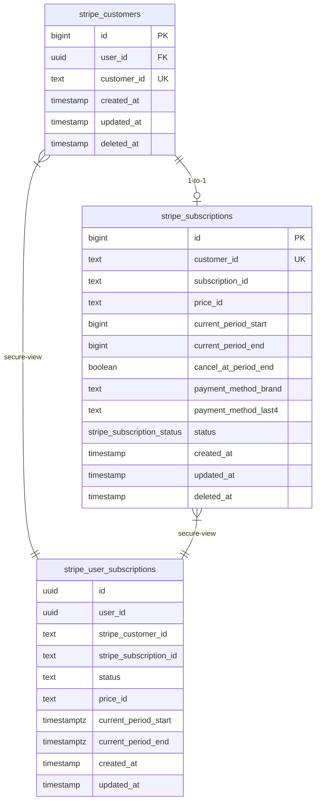
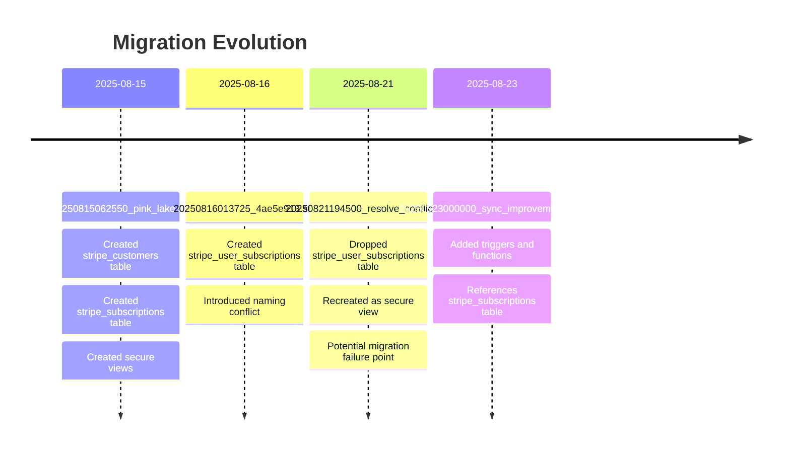
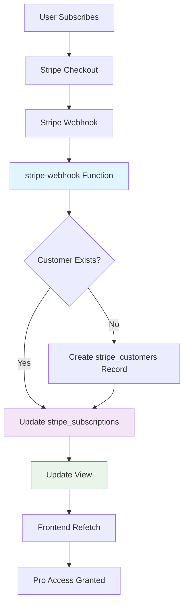

# Stripe Subscriptions Table Error Resolution

## Overview

The error "relation public.stripe_subscriptions does not exist" indicates that the `stripe_subscriptions` table has not been properly created in your Supabase database, despite being defined in the migration files. This design document provides a comprehensive solution to diagnose and resolve this database schema issue.

## Architecture

The Stripe subscription system in HonestInvoice relies on a three-table architecture:



## Problem Analysis

### Root Cause Assessment

The missing `stripe_subscriptions` table error can occur due to several reasons:

1. **Migration Execution Issues**
   - Migrations not run on the target database
   - Migration rollback or failure during execution
   - Environment mismatch (local vs production database)

2. **Schema Conflict Resolution**
   - Earlier migration `20250816013725` created a `stripe_user_subscriptions` table
   - Later migration `20250821194500` attempted to resolve naming conflicts
   - Potential incomplete migration state

3. **Database Connection Issues**
   - Connected to wrong Supabase project
   - Using incorrect database URL or credentials
   - Schema/namespace isolation problems

### Migration Timeline Analysis



## Diagnostic Procedures

### Database Schema Verification

Execute these SQL queries in your Supabase SQL Editor to diagnose the current state:

```sql
-- 1. Check if stripe_subscriptions table exists
SELECT 
    table_name, 
    table_type 
FROM information_schema.tables 
WHERE table_schema = 'public' 
    AND table_name LIKE 'stripe_%';

-- 2. Check migration history
SELECT * FROM supabase_migrations.schema_migrations 
WHERE version LIKE '2025081%' 
ORDER BY version;

-- 3. Check for stripe-related objects
SELECT 
    schemaname,
    tablename,
    tableowner 
FROM pg_tables 
WHERE tablename LIKE 'stripe_%';

-- 4. Check for views
SELECT 
    schemaname,
    viewname,
    viewowner 
FROM pg_views 
WHERE viewname LIKE 'stripe_%';

-- 5. Check for custom types
SELECT 
    n.nspname AS schema_name,
    t.typname AS type_name
FROM pg_type t
JOIN pg_namespace n ON n.oid = t.typnamespace
WHERE t.typname LIKE 'stripe_%';
```

### Migration Status Verification

Check which migrations have been applied:

```sql
-- Check migration status
SELECT 
    version,
    name,
    executed_at
FROM supabase_migrations.schema_migrations 
ORDER BY version DESC;
```

## Resolution Strategy

### Option 1: Complete Migration Reset (Recommended)

If the database is in an inconsistent state, perform a complete migration reset:

```sql
-- Step 1: Drop all stripe-related objects
DROP VIEW IF EXISTS public.stripe_user_subscriptions CASCADE;
DROP VIEW IF EXISTS public.stripe_user_orders CASCADE;
DROP TABLE IF EXISTS public.stripe_subscriptions CASCADE;
DROP TABLE IF EXISTS public.stripe_orders CASCADE;
DROP TABLE IF EXISTS public.stripe_customers CASCADE;
DROP TYPE IF EXISTS public.stripe_subscription_status CASCADE;
DROP TYPE IF EXISTS public.stripe_order_status CASCADE;

-- Step 2: Remove migration records for stripe migrations
DELETE FROM supabase_migrations.schema_migrations 
WHERE version IN (
    '20250815062550',
    '20250816013725', 
    '20250819215423',
    '20250821180000',
    '20250821191500',
    '20250821194500',
    '20250821195500',
    '20250823000000'
);
```

Then re-run migrations using the Supabase CLI:

```bash
# Reset and apply migrations
supabase db reset
supabase db push
```

### Option 2: Manual Table Recreation

If you prefer to manually recreate just the missing table:

```sql
-- Create stripe_subscription_status enum
CREATE TYPE stripe_subscription_status AS ENUM (
    'not_started',
    'incomplete',
    'incomplete_expired',
    'trialing',
    'active',
    'past_due',
    'canceled',
    'unpaid',
    'paused'
);

-- Create stripe_subscriptions table
CREATE TABLE IF NOT EXISTS stripe_subscriptions (
  id bigint primary key generated always as identity,
  customer_id text unique not null,
  subscription_id text default null,
  price_id text default null,
  current_period_start bigint default null,
  current_period_end bigint default null,
  cancel_at_period_end boolean default false,
  payment_method_brand text default null,
  payment_method_last4 text default null,
  status stripe_subscription_status not null,
  created_at timestamp with time zone default now(),
  updated_at timestamp with time zone default now(),
  deleted_at timestamp with time zone default null
);

-- Enable RLS
ALTER TABLE stripe_subscriptions ENABLE ROW LEVEL SECURITY;

-- Create RLS policy
CREATE POLICY "Users can view their own subscription data"
    ON stripe_subscriptions
    FOR SELECT
    TO authenticated
    USING (
        customer_id IN (
            SELECT customer_id
            FROM stripe_customers
            WHERE user_id = auth.uid() AND deleted_at IS NULL
        )
        AND deleted_at IS NULL
    );

-- Create indexes
CREATE INDEX CONCURRENTLY IF NOT EXISTS idx_stripe_subscriptions_customer_id_status 
ON stripe_subscriptions(customer_id, status) 
WHERE deleted_at IS NULL;

-- Add update trigger
CREATE OR REPLACE FUNCTION update_updated_at_column()
RETURNS TRIGGER AS $$
BEGIN
  NEW.updated_at = now();
  RETURN NEW;
END;
$$ LANGUAGE plpgsql;

CREATE TRIGGER update_stripe_subscriptions_updated_at
    BEFORE UPDATE ON stripe_subscriptions
    FOR EACH ROW
    EXECUTE FUNCTION update_updated_at_column();
```

### Option 3: Environment Verification

Ensure you're connected to the correct database:

```bash
# Check current Supabase project
supabase status

# Verify environment variables
echo $SUPABASE_URL
echo $SUPABASE_ANON_KEY

# Link to correct project if needed
supabase link --project-ref YOUR_PROJECT_REF
```

## Data Flow Verification

After resolving the table issue, verify the complete data flow:



## Testing Strategy

### Unit Testing

Test each component individually:

```sql
-- Test 1: Verify table exists and is accessible
SELECT COUNT(*) FROM stripe_subscriptions;

-- Test 2: Verify RLS policy works
SELECT * FROM stripe_subscriptions; -- Should return user's data only

-- Test 3: Verify view functionality
SELECT * FROM stripe_user_subscriptions;

-- Test 4: Test webhook function
SELECT public.ensure_customer_mapping('cus_test123', auth.uid());
```

### Integration Testing

Test the complete flow:

1. **Create Test Subscription**
   ```sql
   -- Insert test customer
   INSERT INTO stripe_customers (user_id, customer_id) 
   VALUES (auth.uid(), 'cus_test123');
   
   -- Insert test subscription
   INSERT INTO stripe_subscriptions (customer_id, status, subscription_id)
   VALUES ('cus_test123', 'active', 'sub_test123');
   ```

2. **Verify View Access**
   ```sql
   SELECT * FROM stripe_user_subscriptions 
   WHERE stripe_customer_id = 'cus_test123';
   ```

3. **Test Frontend Integration**
   - Verify `useStripe` hook returns subscription data
   - Confirm `useProAccess` detects active subscription
   - Test subscription status updates in real-time

## Monitoring and Alerting

### Database Monitoring

Set up monitoring for subscription-related tables:

```sql
-- Create monitoring view
CREATE OR REPLACE VIEW subscription_health_check AS
SELECT 
    'stripe_customers' as table_name,
    COUNT(*) as record_count,
    MAX(updated_at) as last_updated
FROM stripe_customers
WHERE deleted_at IS NULL
UNION ALL
SELECT 
    'stripe_subscriptions' as table_name,
    COUNT(*) as record_count,
    MAX(updated_at) as last_updated
FROM stripe_subscriptions
WHERE deleted_at IS NULL;
```

### Error Tracking

Monitor for common subscription errors:

- Missing customer mappings
- Orphaned subscription records
- Status inconsistencies
- Webhook processing failures

## Stripe Product Configuration

### HonestInvoice Pro Subscription Setup

To properly configure the Stripe integration for HonestInvoice Pro subscriptions, execute the following Stripe API calls:

#### 1. Create Pro Product

```javascript
const stripe = require('stripe')('sk_live_YOUR_SECRET_KEY'); // Use live key for production

const proProduct = await stripe.products.create({
  name: 'HonestInvoice Pro',
  description: 'Professional invoicing features including unlimited invoices, custom branding, recurring invoices, and advanced analytics',
  default_price_data: {
    currency: 'usd',
    recurring: {
      interval: 'month',
      interval_count: 1,
    },
    unit_amount: 1900, // $19.00 per month
  },
  metadata: {
    service: 'honestinvoice',
    tier: 'pro',
    features: 'unlimited_invoices,custom_branding,recurring_invoices,analytics'
  }
});

console.log('Pro Product ID:', proProduct.id);
console.log('Default Price ID:', proProduct.default_price);
```

#### 2. Create Entitlement Features

```javascript
const stripe = require('stripe')('sk_live_YOUR_SECRET_KEY');

// Core Pro Features
const unlimitedInvoicesFeature = await stripe.entitlements.features.create({
  name: 'Unlimited Invoices',
  lookup_key: 'honest-invoice-unlimited-invoices',
  metadata: {
    description: 'Create unlimited invoices without restrictions'
  }
});

const customBrandingFeature = await stripe.entitlements.features.create({
  name: 'Custom Branding',
  lookup_key: 'honest-invoice-custom-branding',
  metadata: {
    description: 'Customize invoice appearance with your brand colors and logo'
  }
});

const recurringInvoicesFeature = await stripe.entitlements.features.create({
  name: 'Recurring Invoices',
  lookup_key: 'honest-invoice-recurring-invoices',
  metadata: {
    description: 'Set up automatic recurring invoice generation'
  }
});

const advancedAnalyticsFeature = await stripe.entitlements.features.create({
  name: 'Advanced Analytics',
  lookup_key: 'honest-invoice-advanced-analytics',
  metadata: {
    description: 'Detailed revenue reports and invoice analytics'
  }
});
```

#### 3. Link Features to Product

```javascript
const stripe = require('stripe')('sk_live_YOUR_SECRET_KEY');

// Link each feature to the Pro product
const productFeatures = [
  unlimitedInvoicesFeature.id,
  customBrandingFeature.id,
  recurringInvoicesFeature.id,
  advancedAnalyticsFeature.id
];

for (const featureId of productFeatures) {
  await stripe.products.createFeature(proProduct.id, {
    entitlement_feature: featureId,
  });
}
```

#### 4. Create Checkout Session

```javascript
const stripe = require('stripe')('sk_live_YOUR_SECRET_KEY');

const createProCheckoutSession = async (customerId) => {
  const session = await stripe.checkout.sessions.create({
    customer: customerId,
    success_url: 'https://honestinvoice.com/dashboard/billing?success=true&session_id={CHECKOUT_SESSION_ID}',
    cancel_url: 'https://honestinvoice.com/dashboard/billing?canceled=true',
    line_items: [
      {
        price: proProduct.default_price, // Use the default price from product creation
        quantity: 1,
      },
    ],
    mode: 'subscription',
    allow_promotion_codes: true,
    billing_address_collection: 'auto',
    metadata: {
      product_type: 'honestinvoice_pro',
      customer_id: customerId
    },
    subscription_data: {
      metadata: {
        product_type: 'honestinvoice_pro'
      }
    }
  });
  
  return session;
};
```

#### 5. Environment Configuration

Update your environment variables:

```bash
# Production Environment Variables
STRIPE_PUBLISHABLE_KEY=pk_live_YOUR_PUBLISHABLE_KEY
STRIPE_SECRET_KEY=sk_live_YOUR_SECRET_KEY
STRIPE_WEBHOOK_SECRET=whsec_YOUR_WEBHOOK_SECRET

# Product Configuration
STRIPE_PRO_PRICE_ID=price_YOUR_PRO_PRICE_ID
STRIPE_PRO_PRODUCT_ID=prod_YOUR_PRO_PRODUCT_ID
```

#### 6. Update Supabase Functions

Ensure your `stripe-checkout` function uses the correct price ID:

```typescript
// In supabase/functions/stripe-checkout/index.ts
const STRIPE_PRO_PRICE_ID = Deno.env.get('STRIPE_PRO_PRICE_ID');

const session = await stripe.checkout.sessions.create({
  customer: stripeCustomerId,
  success_url: `${origin}/dashboard/billing?success=true`,
  cancel_url: `${origin}/dashboard/billing?canceled=true`,
  line_items: [
    {
      price: STRIPE_PRO_PRICE_ID,
      quantity: 1,
    },
  ],
  mode: 'subscription',
  allow_promotion_codes: true,
});
```

### Feature Detection Logic

Update your `useProAccess` hook to check for the specific features:

```typescript
// In src/hooks/useProAccess.ts
const checkFeatureAccess = (featureLookupKey: string) => {
  // Check if user has active subscription with the specific feature
  return subscription?.status === 'active' && 
         subscription?.features?.includes(featureLookupKey);
};

const hasUnlimitedInvoices = checkFeatureAccess('honest-invoice-unlimited-invoices');
const hasCustomBranding = checkFeatureAccess('honest-invoice-custom-branding');
const hasRecurringInvoices = checkFeatureAccess('honest-invoice-recurring-invoices');
const hasAdvancedAnalytics = checkFeatureAccess('honest-invoice-advanced-analytics');
```

### Webhook Integration

Update your `stripe-webhook` function to handle the Pro subscription events:

```typescript
// In supabase/functions/stripe-webhook/index.ts
const handleCheckoutCompleted = async (event: Stripe.Event) => {
  const session = event.data.object as Stripe.Checkout.Session;
  
  if (session.mode === 'subscription') {
    const subscription = await stripe.subscriptions.retrieve(
      session.subscription as string,
      {
        expand: ['items.data.price.product']
      }
    );
    
    // Ensure customer mapping exists
    await ensureCustomerMapping(session.customer as string, null);
    
    // Update subscription data
    const { error: upsertError } = await supabaseAdmin
      .from('stripe_subscriptions')
      .upsert({
        customer_id: session.customer as string,
        subscription_id: subscription.id,
        price_id: subscription.items.data[0].price.id,
        status: subscription.status,
        current_period_start: subscription.current_period_start,
        current_period_end: subscription.current_period_end,
        cancel_at_period_end: subscription.cancel_at_period_end,
        updated_at: new Date().toISOString()
      }, {
        onConflict: 'customer_id'
      });
    
    if (upsertError) {
      console.error('Error upserting subscription:', upsertError);
      throw upsertError;
    }
    
    console.log(`Pro subscription activated for customer: ${session.customer}`);
  }
};

const handleSubscriptionUpdated = async (event: Stripe.Event) => {
  const subscription = event.data.object as Stripe.Subscription;
  
  const { error } = await supabaseAdmin
    .from('stripe_subscriptions')
    .update({
      status: subscription.status,
      current_period_start: subscription.current_period_start,
      current_period_end: subscription.current_period_end,
      cancel_at_period_end: subscription.cancel_at_period_end,
      updated_at: new Date().toISOString()
    })
    .eq('subscription_id', subscription.id);
    
  if (error) {
    console.error('Error updating subscription:', error);
    throw error;
  }
  
  console.log(`Subscription updated: ${subscription.id} - Status: ${subscription.status}`);
};
```

### Subscription Validation

Add validation to ensure the Pro subscription is properly configured:

```sql
-- Add to your database functions
CREATE OR REPLACE FUNCTION public.validate_pro_subscription(p_customer_id text)
RETURNS TABLE (
  is_valid boolean,
  subscription_status text,
  price_id text,
  features_enabled text[],
  validation_errors text[]
)
LANGUAGE plpgsql
SECURITY DEFINER
AS $$
DECLARE
  v_subscription stripe_subscriptions%ROWTYPE;
  v_errors text[] := '{}';
  v_features text[] := '{}';
BEGIN
  -- Get subscription data
  SELECT * INTO v_subscription
  FROM stripe_subscriptions
  WHERE customer_id = p_customer_id
    AND deleted_at IS NULL
  ORDER BY updated_at DESC
  LIMIT 1;
  
  -- Check if subscription exists
  IF v_subscription.id IS NULL THEN
    v_errors := array_append(v_errors, 'No subscription found');
    RETURN QUERY SELECT false, null::text, null::text, v_features, v_errors;
    RETURN;
  END IF;
  
  -- Validate subscription status
  IF v_subscription.status NOT IN ('active', 'trialing') THEN
    v_errors := array_append(v_errors, 'Subscription not active');
  END IF;
  
  -- Validate price ID (should match Pro price)
  IF v_subscription.price_id IS NULL THEN
    v_errors := array_append(v_errors, 'Missing price ID');
  END IF;
  
  -- Define Pro features based on active subscription
  IF v_subscription.status IN ('active', 'trialing') THEN
    v_features := ARRAY[
      'unlimited_invoices',
      'custom_branding', 
      'recurring_invoices',
      'advanced_analytics'
    ];
  END IF;
  
  RETURN QUERY SELECT 
    (array_length(v_errors, 1) IS NULL), -- is_valid: true if no errors
    v_subscription.status::text,
    v_subscription.price_id,
    v_features,
    v_errors;
END;
$$;
```

## Recovery Procedures

### Data Recovery

If data loss occurs during migration:

1. **Backup Verification**
   ```bash
   # Check available backups
   supabase db dump --local > backup.sql
   ```

2. **Selective Recovery**
   ```sql
   -- Recover from backup if needed
   -- Only if you have a recent backup
   ```

3. **Webhook Replay**
   - Use Stripe Dashboard to replay recent webhook events
   - Manually sync subscription data if necessary

### Emergency Fallback

If the issue cannot be resolved quickly:

1. **Temporary Pro Access**
   ```sql
   -- Grant temporary pro access
   UPDATE user_settings 
   SET temp_pro_access = true, 
       temp_pro_expires = now() + interval '24 hours'
   WHERE user_id = 'USER_ID';
   ```

2. **Manual Subscription Creation**
   ```sql
   -- Manually create subscription record
   INSERT INTO stripe_subscriptions (
       customer_id, 
       status, 
       subscription_id,
       price_id
   ) VALUES (
       'CUSTOMER_ID', 
       'active', 
       'SUBSCRIPTION_ID',
       'STRIPE_PRO_PRICE_ID'
   );
   ```


