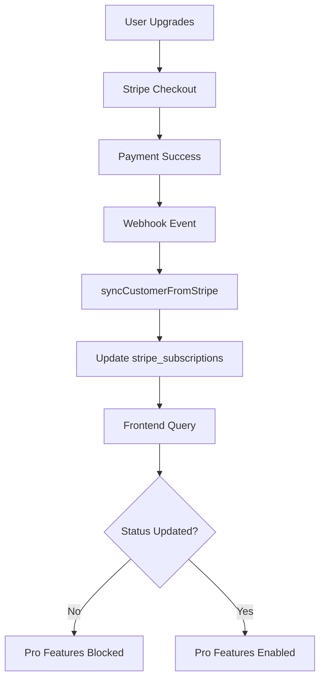
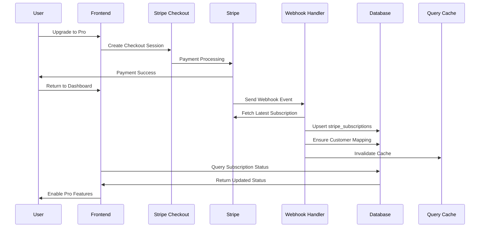
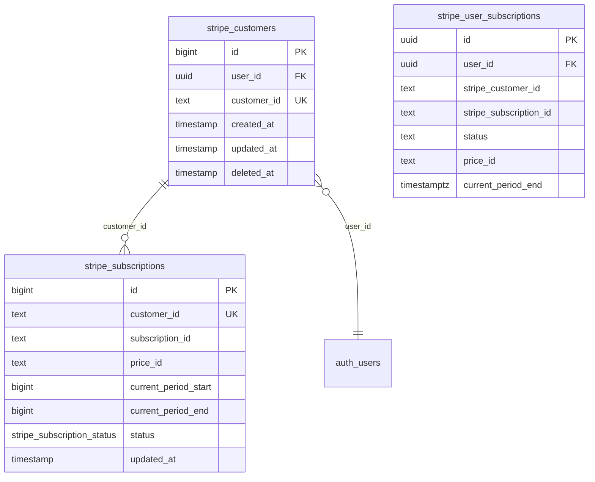
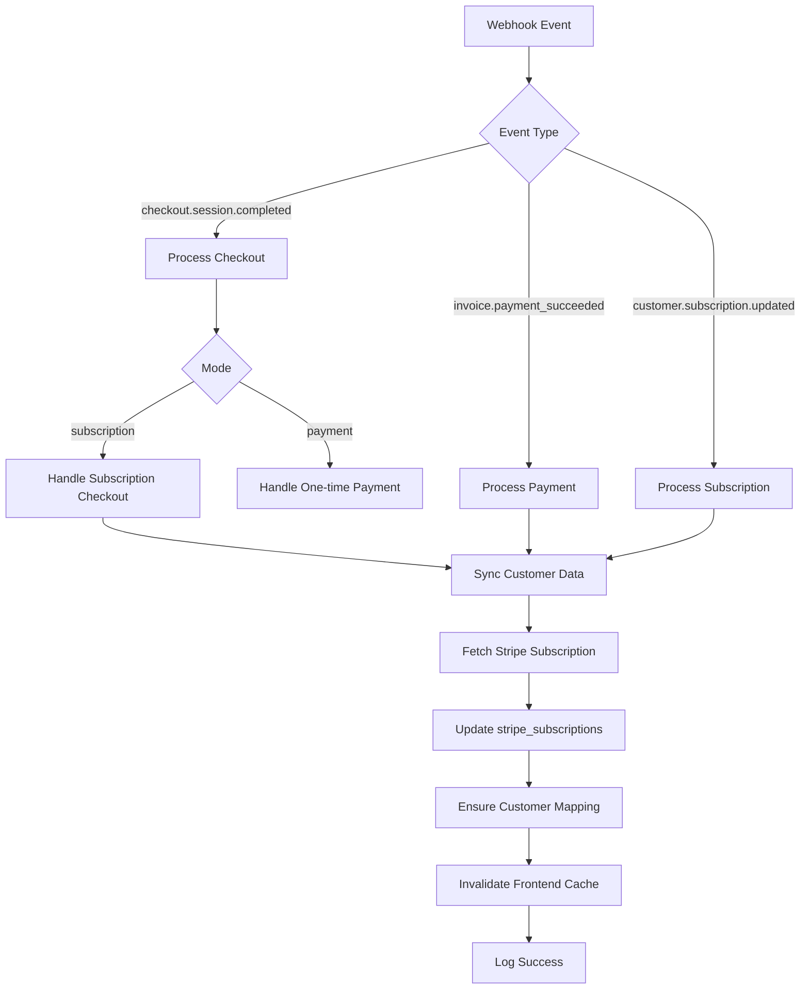
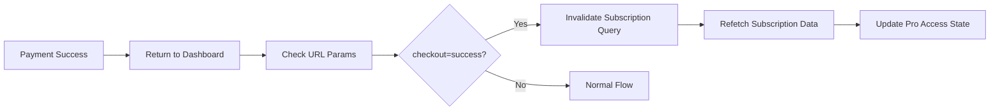
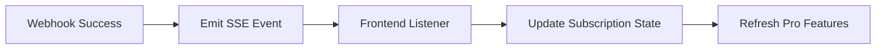
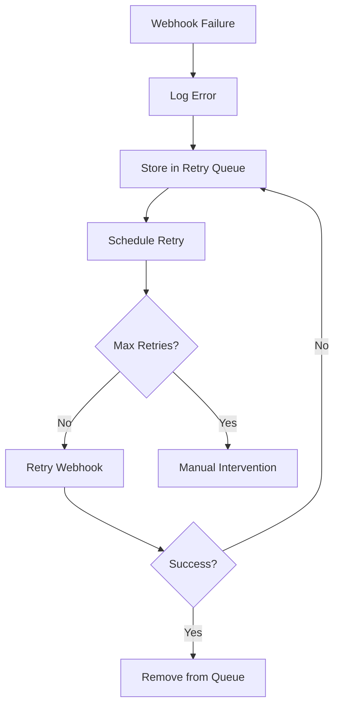
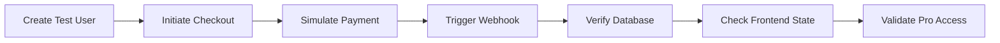

# Subscription Update Handler Design

## Overview

This design addresses critical issues with subscription status updates not properly reflecting pro feature access after account upgrades in the HonestInvoice application. The current implementation has several architectural gaps that prevent subscription status changes from propagating correctly to the frontend, resulting in users unable to access pro features immediately after successful payments.

## Problem Analysis

### Current Architecture Issues

The existing subscription update flow has multiple disconnected components that create synchronization gaps:



### Root Cause Analysis

#### 1. Data Model Inconsistency
The system operates with conflicting data structures:
- `stripe_subscriptions` table (primary Stripe data)
- `stripe_user_subscriptions` view/table (user-facing data)
- Frontend expects specific field names and formats

#### 2. Query Caching Issues
Frontend subscription queries may cache stale data, preventing immediate status updates after payment completion.

#### 3. Webhook Processing Gaps
The webhook handler updates `stripe_subscriptions` but doesn't ensure the user-facing view reflects changes immediately.

#### 4. Missing Customer-User Linking
If the `stripe_customers` table doesn't properly link Stripe customers to Supabase users, subscription data won't be accessible through the user-scoped view.

## Architecture Design

### Enhanced Data Flow Architecture



### Database Schema Optimization

#### Primary Tables Structure


### Enhanced Webhook Handler

#### Comprehensive Event Processing
The webhook handler needs to handle multiple scenarios:



#### Critical Webhook Events to Handle
- `checkout.session.completed`: Initial subscription creation
- `invoice.payment_succeeded`: Recurring payment success
- `customer.subscription.updated`: Status changes
- `customer.subscription.deleted`: Cancellations
- `invoice.payment_failed`: Payment failures

### Frontend State Management

#### Query Invalidation Strategy


#### Subscription Status Normalization
Standardize status handling across different data sources:

| Source | Status Field | Period End Field | Format |
|--------|-------------|------------------|---------|
| stripe_subscriptions | status (enum) | current_period_end (bigint) | Epoch seconds |
| stripe_user_subscriptions | status (text) | current_period_end (timestamptz) | ISO timestamp |
| Stripe API | status (string) | current_period_end (number) | Epoch seconds |

## Implementation Strategy

### Phase 1: Database Layer Fixes

#### Customer-User Mapping Validation
Ensure every user has a proper customer mapping:

```sql
-- Validate customer mappings
SELECT u.id as user_id, u.email, c.customer_id
FROM auth.users u
LEFT JOIN stripe_customers c ON c.user_id = u.id
WHERE c.customer_id IS NULL;
```

#### Subscription Data Consistency
Verify subscription data integrity:

```sql
-- Check subscription consistency
SELECT c.user_id, c.customer_id, s.status, s.subscription_id
FROM stripe_customers c
LEFT JOIN stripe_subscriptions s ON s.customer_id = c.customer_id
WHERE c.deleted_at IS NULL;
```

### Phase 2: Webhook Handler Enhancement

#### Improved Error Handling
Add comprehensive error handling and retry logic:

```typescript
async function syncCustomerFromStripe(customerId: string, retryCount = 0) {
  try {
    // Existing sync logic...
    
    // Add cache invalidation
    await invalidateUserSubscriptionCache(customerId);
    
  } catch (error) {
    if (retryCount < 3) {
      console.warn(`Retry ${retryCount + 1} for customer ${customerId}`);
      return await syncCustomerFromStripe(customerId, retryCount + 1);
    }
    throw error;
  }
}
```

#### Customer Mapping Verification
Ensure customer-user relationship exists:

```typescript
async function ensureCustomerMapping(customerId: string) {
  const { data: customer } = await supabase
    .from('stripe_customers')
    .select('user_id')
    .eq('customer_id', customerId)
    .single();
    
  if (!customer) {
    // Fetch customer from Stripe and create mapping
    const stripeCustomer = await stripe.customers.retrieve(customerId);
    if (stripeCustomer.metadata?.userId) {
      await supabase.from('stripe_customers').insert({
        user_id: stripeCustomer.metadata.userId,
        customer_id: customerId
      });
    }
  }
}
```

### Phase 3: Frontend Optimization

#### Smart Query Invalidation
Detect successful payments and force subscription refresh:

```typescript
export const useSubscriptionWithInvalidation = () => {
  const queryClient = useQueryClient();
  const subscription = useSubscription();
  
  useEffect(() => {
    const urlParams = new URLSearchParams(window.location.search);
    if (urlParams.get('checkout') === 'success') {
      queryClient.invalidateQueries(['subscription']);
      // Remove URL parameter to prevent repeated invalidation
      window.history.replaceState({}, '', window.location.pathname);
    }
  }, [queryClient]);
  
  return subscription;
};
```

#### Optimistic Updates
Provide immediate feedback while waiting for server confirmation:

```typescript
export const useOptimisticSubscription = () => {
  const [optimisticStatus, setOptimisticStatus] = useState<string | null>(null);
  const subscription = useSubscription();
  
  const updateOptimisticStatus = (status: string) => {
    setOptimisticStatus(status);
    // Clear after 30 seconds to prevent stale optimistic state
    setTimeout(() => setOptimisticStatus(null), 30000);
  };
  
  return {
    ...subscription,
    data: optimisticStatus ? { ...subscription.data, status: optimisticStatus } : subscription.data,
    updateOptimisticStatus
  };
};
```

## Data Synchronization Patterns

### Real-time Subscription Updates
Implement server-sent events for immediate status updates:



### Polling Fallback Strategy
Implement intelligent polling as backup:

```typescript
export const useSubscriptionPolling = (enabled: boolean) => {
  return useQuery({
    queryKey: ['subscription-poll'],
    queryFn: fetchSubscription,
    enabled,
    refetchInterval: 5000, // Poll every 5 seconds
    refetchIntervalInBackground: false,
    staleTime: 0 // Always consider stale during polling
  });
};
```

## Error Handling & Recovery

### Webhook Failure Recovery
Handle webhook delivery failures:



### Frontend Error States
Provide clear error messaging:

```typescript
export const SubscriptionErrorBoundary = ({ children }) => {
  const { subscription, error, isLoading } = useSubscription();
  
  if (error) {
    return (
      <Alert variant="destructive">
        <AlertDescription>
          Unable to load subscription status. 
          <Button onClick={() => window.location.reload()}>
            Refresh Page
          </Button>
        </AlertDescription>
      </Alert>
    );
  }
  
  return children;
};
```

## Testing Strategy

### Integration Testing
Test complete subscription upgrade flow:



### Webhook Testing
Test webhook scenarios:
- Successful subscription creation
- Payment failures
- Subscription updates
- Cancellations
- Network failures

### Frontend Testing
Test subscription state management:
- Initial load with no subscription
- Successful upgrade flow
- Failed payment handling
- Cache invalidation
- Optimistic updates

## Monitoring & Observability

### Key Metrics to Track
- Webhook processing success rate
- Subscription sync latency
- Frontend query success rate
- Pro feature access errors
- Payment-to-activation time

### Logging Strategy
Implement structured logging:

```typescript
const logger = {
  webhookReceived: (eventType: string, customerId: string) => {
    console.log({
      event: 'webhook_received',
      type: eventType,
      customer_id: customerId,
      timestamp: new Date().toISOString()
    });
  },
  
  subscriptionSynced: (customerId: string, status: string) => {
    console.log({
      event: 'subscription_synced',
      customer_id: customerId,
      status,
      timestamp: new Date().toISOString()
    });
  }
};
```

## Performance Considerations

### Database Optimization
- Index on `stripe_customers.customer_id`
- Index on `stripe_subscriptions.customer_id`
- Proper RLS policies for performance

### Frontend Optimization
- Minimize subscription query frequency
- Use React Query for intelligent caching
- Implement query deduplication

### Webhook Optimization
- Batch database operations when possible
- Use database transactions for consistency
- Implement idempotent processing

## Security Considerations

### Webhook Security
- Verify webhook signatures
- Use HTTPS endpoints only
- Implement rate limiting
- Log suspicious activities

### Data Privacy
- Minimize stored customer data
- Encrypt sensitive information
- Implement proper access controls
- Regular security audits


