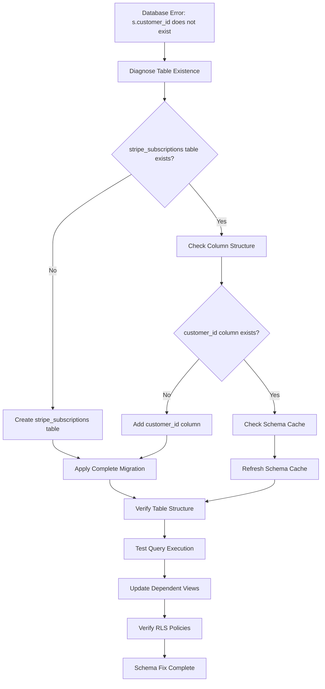

# Database Schema Fix: Resolve Missing stripe_subscriptions.customer_id Column

## Overview

This design addresses the critical database error "column s.customer_id does not exist" occurring in the HonestInvoice application. The error stems from queries attempting to join the `stripe_subscriptions` table (aliased as 's') with `stripe_customers` table, but the `stripe_subscriptions` table either doesn't exist, is missing the `customer_id` column, or has schema inconsistencies.

## Problem Analysis

The error occurs in multiple SQL contexts where queries attempt to access `s.customer_id`:

1. **Subscription Status Queries**: Functions like `is_pro_user()` that check user subscription status
2. **View Definitions**: `stripe_user_subscriptions` view joins customer and subscription data
3. **RLS Policies**: Row Level Security policies that filter data by customer relationship

### Root Causes Identified

1. **Schema Cache Issues**: Supabase schema cache may not reflect actual table structure
2. **Incomplete Migrations**: Migration files may not have been properly applied
3. **Table Existence**: The `stripe_subscriptions` table may be missing entirely
4. **Column Definition**: The `customer_id` column may be missing from the table structure

## Architecture

### Complete Database Schema Structure

```mermaid
erDiagram
    %% Core Application Tables
    users {
        uuid id PK
        text email
        jsonb raw_user_meta_data
        timestamptz created_at
        timestamptz updated_at
    }
    
    clients {
        uuid id PK
        uuid user_id FK
        text name
        text email
        text company
        text address
        text notes
        timestamptz created_at
        timestamptz updated_at
    }
    
    invoices {
        uuid id PK
        uuid user_id FK
        uuid client_id FK
        text number
        date issue_date
        date due_date
        invoice_status status
        numeric subtotal
        numeric tax
        numeric total
        text notes
        timestamptz created_at
        timestamptz updated_at
    }
    
    invoice_items {
        uuid id PK
        uuid invoice_id FK
        text description
        numeric quantity
        numeric unit_price
        numeric amount
        integer position
        timestamptz created_at
        timestamptz updated_at
    }
    
    recurring_invoices {
        uuid id PK
        uuid user_id FK
        uuid client_id FK
        text template_number
        recurring_frequency frequency
        date next_due_date
        date last_generated_date
        boolean is_active
        numeric subtotal
        numeric tax
        numeric total
        text notes
        timestamptz created_at
        timestamptz updated_at
    }
    
    recurring_invoice_items {
        uuid id PK
        uuid recurring_invoice_id FK
        text description
        numeric quantity
        numeric unit_price
        numeric amount
        integer position
        timestamptz created_at
        timestamptz updated_at
    }
    
    user_settings {
        uuid id PK
        uuid user_id FK
        text display_name
        text company_name
        text company_logo_url
        text address
        text phone
        text website
        text currency
        numeric tax_rate
        text invoice_terms
        text invoice_footer
        timestamptz created_at
        timestamptz updated_at
    }
    
    %% Stripe Integration Tables
    stripe_customers {
        bigint id PK
        uuid user_id FK
        text customer_id UK
        timestamptz created_at
        timestamptz updated_at
        timestamptz deleted_at
    }
    
    stripe_subscriptions {
        bigint id PK
        text customer_id UK_FK
        text subscription_id
        text price_id
        bigint current_period_start
        bigint current_period_end
        boolean cancel_at_period_end
        text payment_method_brand
        text payment_method_last4
        stripe_subscription_status status
        timestamptz created_at
        timestamptz updated_at
        timestamptz deleted_at
    }
    
    stripe_user_subscriptions_view {
        uuid id
        uuid user_id
        text stripe_customer_id
        text stripe_subscription_id
        text status
        text price_id
        timestamptz current_period_start
        timestamptz current_period_end
        timestamptz created_at
        timestamptz updated_at
    }
    
    %% Relationships
    users ||--o{ clients : "owns"
    users ||--o{ invoices : "creates"
    users ||--o{ recurring_invoices : "creates"
    users ||--|| user_settings : "has"
    users ||--|| stripe_customers : "mapped_to"
    
    clients ||--o{ invoices : "billed_to"
    clients ||--o{ recurring_invoices : "recurring_for"
    
    invoices ||--o{ invoice_items : "contains"
    recurring_invoices ||--o{ recurring_invoice_items : "contains"
    
    stripe_customers ||--o{ stripe_subscriptions : "customer_id"
    stripe_customers ||--|| stripe_user_subscriptions_view : "view_join"
    stripe_subscriptions ||--|| stripe_user_subscriptions_view : "view_join"
```

### Problem Resolution Flow



## Database Schema Repair Strategy

### Required Table Definitions

#### Core Application Tables

**1. users (Managed by Supabase Auth)**
- Primary identifier for all user-owned data
- Automatically managed by Supabase authentication system
- Referenced by user_id columns throughout the schema

**2. clients**
```sql
CREATE TABLE IF NOT EXISTS public.clients (
  id UUID PRIMARY KEY DEFAULT gen_random_uuid(),
  user_id UUID NOT NULL REFERENCES auth.users(id),
  name TEXT NOT NULL,
  email TEXT,
  company TEXT,
  address TEXT,
  notes TEXT,
  created_at TIMESTAMPTZ NOT NULL DEFAULT now(),
  updated_at TIMESTAMPTZ NOT NULL DEFAULT now()
);
```

**3. invoices**
```sql
CREATE TYPE invoice_status AS ENUM ('draft', 'sent', 'paid', 'overdue', 'void');

CREATE TABLE IF NOT EXISTS public.invoices (
  id UUID PRIMARY KEY DEFAULT gen_random_uuid(),
  user_id UUID NOT NULL REFERENCES auth.users(id),
  client_id UUID NOT NULL REFERENCES clients(id) ON DELETE CASCADE,
  number TEXT NOT NULL,
  issue_date DATE NOT NULL,
  due_date DATE,
  status invoice_status NOT NULL DEFAULT 'draft',
  subtotal NUMERIC NOT NULL DEFAULT 0,
  tax NUMERIC NOT NULL DEFAULT 0,
  total NUMERIC NOT NULL DEFAULT 0,
  notes TEXT,
  created_at TIMESTAMPTZ NOT NULL DEFAULT now(),
  updated_at TIMESTAMPTZ NOT NULL DEFAULT now()
);
```

**4. invoice_items**
```sql
CREATE TABLE IF NOT EXISTS public.invoice_items (
  id UUID PRIMARY KEY DEFAULT gen_random_uuid(),
  invoice_id UUID NOT NULL REFERENCES invoices(id) ON DELETE CASCADE,
  description TEXT NOT NULL,
  quantity NUMERIC NOT NULL DEFAULT 1,
  unit_price NUMERIC NOT NULL DEFAULT 0,
  amount NUMERIC,
  position INTEGER NOT NULL DEFAULT 1,
  created_at TIMESTAMPTZ NOT NULL DEFAULT now(),
  updated_at TIMESTAMPTZ NOT NULL DEFAULT now()
);
```

**5. recurring_invoices**
```sql
CREATE TYPE recurring_frequency AS ENUM ('weekly', 'monthly', 'quarterly', 'annually');

CREATE TABLE IF NOT EXISTS public.recurring_invoices (
  id UUID PRIMARY KEY DEFAULT gen_random_uuid(),
  user_id UUID NOT NULL REFERENCES auth.users(id),
  client_id UUID NOT NULL REFERENCES clients(id) ON DELETE CASCADE,
  template_number TEXT NOT NULL,
  frequency recurring_frequency NOT NULL DEFAULT 'monthly',
  next_due_date DATE NOT NULL,
  last_generated_date DATE,
  is_active BOOLEAN NOT NULL DEFAULT true,
  subtotal NUMERIC NOT NULL DEFAULT 0,
  tax NUMERIC NOT NULL DEFAULT 0,
  total NUMERIC NOT NULL DEFAULT 0,
  notes TEXT,
  created_at TIMESTAMPTZ NOT NULL DEFAULT now(),
  updated_at TIMESTAMPTZ NOT NULL DEFAULT now()
);
```

**6. recurring_invoice_items**
```sql
CREATE TABLE IF NOT EXISTS public.recurring_invoice_items (
  id UUID PRIMARY KEY DEFAULT gen_random_uuid(),
  recurring_invoice_id UUID NOT NULL REFERENCES recurring_invoices(id) ON DELETE CASCADE,
  description TEXT NOT NULL,
  quantity NUMERIC NOT NULL DEFAULT 1,
  unit_price NUMERIC NOT NULL DEFAULT 0,
  amount NUMERIC,
  position INTEGER NOT NULL DEFAULT 1,
  created_at TIMESTAMPTZ NOT NULL DEFAULT now(),
  updated_at TIMESTAMPTZ NOT NULL DEFAULT now()
);
```

**7. user_settings**
```sql
CREATE TABLE IF NOT EXISTS public.user_settings (
  id UUID PRIMARY KEY DEFAULT gen_random_uuid(),
  user_id UUID NOT NULL UNIQUE REFERENCES auth.users(id),
  display_name TEXT,
  company_name TEXT,
  company_logo_url TEXT,
  address TEXT,
  phone TEXT,
  website TEXT,
  currency TEXT NOT NULL DEFAULT 'USD',
  tax_rate NUMERIC DEFAULT 0,
  invoice_terms TEXT,
  invoice_footer TEXT,
  created_at TIMESTAMPTZ NOT NULL DEFAULT now(),
  updated_at TIMESTAMPTZ NOT NULL DEFAULT now()
);
```

#### Stripe Integration Tables

**8. stripe_customers**
```sql
CREATE TABLE IF NOT EXISTS stripe_customers (
  id bigint primary key generated always as identity,
  user_id uuid references auth.users(id) not null unique,
  customer_id text not null unique,
  created_at timestamp with time zone default now(),
  updated_at timestamp with time zone default now(),
  deleted_at timestamp with time zone default null
);
```

**9. stripe_subscriptions**
```sql
CREATE TYPE stripe_subscription_status AS ENUM (
    'not_started',
    'incomplete',
    'incomplete_expired',
    'trialing',
    'active',
    'past_due',
    'canceled',
    'unpaid',
    'paused'
);

CREATE TABLE IF NOT EXISTS stripe_subscriptions (
  id bigint primary key generated always as identity,
  customer_id text unique not null,
  subscription_id text default null,
  price_id text default null,
  current_period_start bigint default null,
  current_period_end bigint default null,
  cancel_at_period_end boolean default false,
  payment_method_brand text default null,
  payment_method_last4 text default null,
  status stripe_subscription_status not null,
  created_at timestamp with time zone default now(),
  updated_at timestamp with time zone default now(),
  deleted_at timestamp with time zone default null
);
```

**10. stripe_user_subscriptions (View)**
```sql
CREATE OR REPLACE VIEW public.stripe_user_subscriptions
WITH (security_invoker = true) AS
SELECT
  u.id AS id,
  c.user_id,
  c.customer_id AS stripe_customer_id,
  s.subscription_id AS stripe_subscription_id,
  s.status::text AS status,
  s.price_id,
  CASE WHEN s.current_period_start IS NULL THEN NULL 
       ELSE to_timestamp(s.current_period_start)::timestamptz END AS current_period_start,
  CASE WHEN s.current_period_end IS NULL THEN NULL 
       ELSE to_timestamp(s.current_period_end)::timestamptz END AS current_period_end,
  s.created_at,
  s.updated_at
FROM public.stripe_customers c
JOIN auth.users u ON u.id = c.user_id
LEFT JOIN public.stripe_subscriptions s ON s.customer_id = c.customer_id
WHERE c.deleted_at IS NULL AND (s.deleted_at IS NULL OR s.deleted_at IS NOT NULL);
```

#### Performance Optimization

**Create comprehensive indexes:**
```sql
-- Core table indexes
CREATE INDEX CONCURRENTLY IF NOT EXISTS idx_clients_user_id 
  ON public.clients(user_id) WHERE deleted_at IS NULL;

CREATE INDEX CONCURRENTLY IF NOT EXISTS idx_invoices_user_id 
  ON public.invoices(user_id);

CREATE INDEX CONCURRENTLY IF NOT EXISTS idx_invoices_client_id 
  ON public.invoices(client_id);

CREATE INDEX CONCURRENTLY IF NOT EXISTS idx_invoices_status 
  ON public.invoices(status);

CREATE INDEX CONCURRENTLY IF NOT EXISTS idx_invoices_issue_date 
  ON public.invoices(issue_date);

CREATE INDEX CONCURRENTLY IF NOT EXISTS idx_invoice_items_invoice_id 
  ON public.invoice_items(invoice_id);

CREATE INDEX CONCURRENTLY IF NOT EXISTS idx_invoice_items_position 
  ON public.invoice_items(invoice_id, position);

CREATE INDEX CONCURRENTLY IF NOT EXISTS idx_recurring_invoices_user_id 
  ON public.recurring_invoices(user_id);

CREATE INDEX CONCURRENTLY IF NOT EXISTS idx_recurring_invoices_client_id 
  ON public.recurring_invoices(client_id);

CREATE INDEX CONCURRENTLY IF NOT EXISTS idx_recurring_invoices_next_due 
  ON public.recurring_invoices(next_due_date) WHERE is_active = true;

CREATE INDEX CONCURRENTLY IF NOT EXISTS idx_recurring_invoice_items_recurring_id 
  ON public.recurring_invoice_items(recurring_invoice_id);

CREATE INDEX CONCURRENTLY IF NOT EXISTS idx_user_settings_user_id 
  ON public.user_settings(user_id);

-- Stripe table indexes
CREATE INDEX CONCURRENTLY IF NOT EXISTS idx_stripe_customers_user_id_customer_id 
  ON stripe_customers(user_id, customer_id) WHERE deleted_at IS NULL;

CREATE INDEX CONCURRENTLY IF NOT EXISTS idx_stripe_subscriptions_customer_id_status 
  ON stripe_subscriptions(customer_id, status) WHERE deleted_at IS NULL;

CREATE INDEX CONCURRENTLY IF NOT EXISTS idx_stripe_subscriptions_subscription_id 
  ON stripe_subscriptions(subscription_id) WHERE deleted_at IS NULL;
```

## Complete Migration Script

**Execute this comprehensive migration to ensure all tables exist:**

```sql
-- ===============================================
-- COMPLETE HONESTINVOICE DATABASE SCHEMA SETUP
-- ===============================================

-- 1. Create custom types
DO $$ 
BEGIN
  IF NOT EXISTS (SELECT 1 FROM pg_type WHERE typname = 'invoice_status') THEN
    CREATE TYPE invoice_status AS ENUM ('draft', 'sent', 'paid', 'overdue', 'void');
  END IF;
  
  IF NOT EXISTS (SELECT 1 FROM pg_type WHERE typname = 'recurring_frequency') THEN
    CREATE TYPE recurring_frequency AS ENUM ('weekly', 'monthly', 'quarterly', 'annually');
  END IF;
  
  IF NOT EXISTS (SELECT 1 FROM pg_type WHERE typname = 'stripe_subscription_status') THEN
    CREATE TYPE stripe_subscription_status AS ENUM (
      'not_started', 'incomplete', 'incomplete_expired', 'trialing',
      'active', 'past_due', 'canceled', 'unpaid', 'paused'
    );
  END IF;
END $$;

-- 2. Core application tables
CREATE TABLE IF NOT EXISTS public.clients (
  id UUID PRIMARY KEY DEFAULT gen_random_uuid(),
  user_id UUID NOT NULL REFERENCES auth.users(id),
  name TEXT NOT NULL,
  email TEXT,
  company TEXT,
  address TEXT,
  notes TEXT,
  created_at TIMESTAMPTZ NOT NULL DEFAULT now(),
  updated_at TIMESTAMPTZ NOT NULL DEFAULT now()
);

CREATE TABLE IF NOT EXISTS public.invoices (
  id UUID PRIMARY KEY DEFAULT gen_random_uuid(),
  user_id UUID NOT NULL REFERENCES auth.users(id),
  client_id UUID NOT NULL REFERENCES clients(id) ON DELETE CASCADE,
  number TEXT NOT NULL,
  issue_date DATE NOT NULL,
  due_date DATE,
  status invoice_status NOT NULL DEFAULT 'draft',
  subtotal NUMERIC NOT NULL DEFAULT 0,
  tax NUMERIC NOT NULL DEFAULT 0,
  total NUMERIC NOT NULL DEFAULT 0,
  notes TEXT,
  created_at TIMESTAMPTZ NOT NULL DEFAULT now(),
  updated_at TIMESTAMPTZ NOT NULL DEFAULT now()
);

CREATE TABLE IF NOT EXISTS public.invoice_items (
  id UUID PRIMARY KEY DEFAULT gen_random_uuid(),
  invoice_id UUID NOT NULL REFERENCES invoices(id) ON DELETE CASCADE,
  description TEXT NOT NULL,
  quantity NUMERIC NOT NULL DEFAULT 1,
  unit_price NUMERIC NOT NULL DEFAULT 0,
  amount NUMERIC,
  position INTEGER NOT NULL DEFAULT 1,
  created_at TIMESTAMPTZ NOT NULL DEFAULT now(),
  updated_at TIMESTAMPTZ NOT NULL DEFAULT now()
);

CREATE TABLE IF NOT EXISTS public.recurring_invoices (
  id UUID PRIMARY KEY DEFAULT gen_random_uuid(),
  user_id UUID NOT NULL REFERENCES auth.users(id),
  client_id UUID NOT NULL REFERENCES clients(id) ON DELETE CASCADE,
  template_number TEXT NOT NULL,
  frequency recurring_frequency NOT NULL DEFAULT 'monthly',
  next_due_date DATE NOT NULL,
  last_generated_date DATE,
  is_active BOOLEAN NOT NULL DEFAULT true,
  subtotal NUMERIC NOT NULL DEFAULT 0,
  tax NUMERIC NOT NULL DEFAULT 0,
  total NUMERIC NOT NULL DEFAULT 0,
  notes TEXT,
  created_at TIMESTAMPTZ NOT NULL DEFAULT now(),
  updated_at TIMESTAMPTZ NOT NULL DEFAULT now()
);

CREATE TABLE IF NOT EXISTS public.recurring_invoice_items (
  id UUID PRIMARY KEY DEFAULT gen_random_uuid(),
  recurring_invoice_id UUID NOT NULL REFERENCES recurring_invoices(id) ON DELETE CASCADE,
  description TEXT NOT NULL,
  quantity NUMERIC NOT NULL DEFAULT 1,
  unit_price NUMERIC NOT NULL DEFAULT 0,
  amount NUMERIC,
  position INTEGER NOT NULL DEFAULT 1,
  created_at TIMESTAMPTZ NOT NULL DEFAULT now(),
  updated_at TIMESTAMPTZ NOT NULL DEFAULT now()
);

CREATE TABLE IF NOT EXISTS public.user_settings (
  id UUID PRIMARY KEY DEFAULT gen_random_uuid(),
  user_id UUID NOT NULL UNIQUE REFERENCES auth.users(id),
  display_name TEXT,
  company_name TEXT,
  company_logo_url TEXT,
  address TEXT,
  phone TEXT,
  website TEXT,
  currency TEXT NOT NULL DEFAULT 'USD',
  tax_rate NUMERIC DEFAULT 0,
  invoice_terms TEXT,
  invoice_footer TEXT,
  created_at TIMESTAMPTZ NOT NULL DEFAULT now(),
  updated_at TIMESTAMPTZ NOT NULL DEFAULT now()
);

-- 3. Stripe integration tables
CREATE TABLE IF NOT EXISTS stripe_customers (
  id bigint primary key generated always as identity,
  user_id uuid references auth.users(id) not null unique,
  customer_id text not null unique,
  created_at timestamp with time zone default now(),
  updated_at timestamp with time zone default now(),
  deleted_at timestamp with time zone default null
);

CREATE TABLE IF NOT EXISTS stripe_subscriptions (
  id bigint primary key generated always as identity,
  customer_id text unique not null,
  subscription_id text default null,
  price_id text default null,
  current_period_start bigint default null,
  current_period_end bigint default null,
  cancel_at_period_end boolean default false,
  payment_method_brand text default null,
  payment_method_last4 text default null,
  status stripe_subscription_status not null,
  created_at timestamp with time zone default now(),
  updated_at timestamp with time zone default now(),
  deleted_at timestamp with time zone default null
);

-- 4. Essential functions
CREATE OR REPLACE FUNCTION update_updated_at_column()
RETURNS TRIGGER AS $$
BEGIN
  NEW.updated_at = now();
  RETURN NEW;
END;
$$ LANGUAGE plpgsql;

-- 5. Enable RLS on all tables
ALTER TABLE public.clients ENABLE ROW LEVEL SECURITY;
ALTER TABLE public.invoices ENABLE ROW LEVEL SECURITY;
ALTER TABLE public.invoice_items ENABLE ROW LEVEL SECURITY;
ALTER TABLE public.recurring_invoices ENABLE ROW LEVEL SECURITY;
ALTER TABLE public.recurring_invoice_items ENABLE ROW LEVEL SECURITY;
ALTER TABLE public.user_settings ENABLE ROW LEVEL SECURITY;
ALTER TABLE stripe_customers ENABLE ROW LEVEL SECURITY;
ALTER TABLE stripe_subscriptions ENABLE ROW LEVEL SECURITY;

-- 6. Create critical indexes
CREATE INDEX CONCURRENTLY IF NOT EXISTS idx_clients_user_id ON public.clients(user_id);
CREATE INDEX CONCURRENTLY IF NOT EXISTS idx_invoices_user_id ON public.invoices(user_id);
CREATE INDEX CONCURRENTLY IF NOT EXISTS idx_invoices_client_id ON public.invoices(client_id);
CREATE INDEX CONCURRENTLY IF NOT EXISTS idx_invoice_items_invoice_id ON public.invoice_items(invoice_id);
CREATE INDEX CONCURRENTLY IF NOT EXISTS idx_recurring_invoices_user_id ON public.recurring_invoices(user_id);
CREATE INDEX CONCURRENTLY IF NOT EXISTS idx_recurring_invoice_items_recurring_id ON public.recurring_invoice_items(recurring_invoice_id);
CREATE INDEX CONCURRENTLY IF NOT EXISTS idx_user_settings_user_id ON public.user_settings(user_id);
CREATE INDEX CONCURRENTLY IF NOT EXISTS idx_stripe_customers_user_id_customer_id ON stripe_customers(user_id, customer_id) WHERE deleted_at IS NULL;
CREATE INDEX CONCURRENTLY IF NOT EXISTS idx_stripe_subscriptions_customer_id_status ON stripe_subscriptions(customer_id, status) WHERE deleted_at IS NULL;

-- 7. Create essential triggers
DO $$
DECLARE
  tables text[] := ARRAY['clients', 'invoices', 'invoice_items', 'recurring_invoices', 'recurring_invoice_items', 'user_settings'];
  table_name text;
BEGIN
  FOREACH table_name IN ARRAY tables
  LOOP
    EXECUTE format('
      CREATE TRIGGER IF NOT EXISTS update_%I_updated_at
        BEFORE UPDATE ON public.%I
        FOR EACH ROW EXECUTE FUNCTION update_updated_at_column();
    ', table_name, table_name);
  END LOOP;
END$$;

CREATE TRIGGER IF NOT EXISTS update_stripe_customers_updated_at
  BEFORE UPDATE ON stripe_customers
  FOR EACH ROW EXECUTE FUNCTION update_updated_at_column();

CREATE TRIGGER IF NOT EXISTS update_stripe_subscriptions_updated_at
  BEFORE UPDATE ON stripe_subscriptions
  FOR EACH ROW EXECUTE FUNCTION update_updated_at_column();

-- 8. Recreate stripe_user_subscriptions view
CREATE OR REPLACE VIEW public.stripe_user_subscriptions
WITH (security_invoker = true) AS
SELECT
  u.id AS id,
  c.user_id,
  c.customer_id AS stripe_customer_id,
  s.subscription_id AS stripe_subscription_id,
  s.status::text AS status,
  s.price_id,
  CASE WHEN s.current_period_start IS NULL THEN NULL 
       ELSE to_timestamp(s.current_period_start)::timestamptz END AS current_period_start,
  CASE WHEN s.current_period_end IS NULL THEN NULL 
       ELSE to_timestamp(s.current_period_end)::timestamptz END AS current_period_end,
  s.created_at,
  s.updated_at
FROM public.stripe_customers c
JOIN auth.users u ON u.id = c.user_id
LEFT JOIN public.stripe_subscriptions s ON s.customer_id = c.customer_id
WHERE c.deleted_at IS NULL AND (s.deleted_at IS NULL OR s.deleted_at IS NOT NULL);

GRANT SELECT ON public.stripe_user_subscriptions TO authenticated;
GRANT SELECT ON stripe_subscriptions TO authenticated;
```

**Phase 2: Security and Constraints**
```sql
-- Enable RLS
ALTER TABLE stripe_subscriptions ENABLE ROW LEVEL SECURITY;

-- Create RLS policy
CREATE POLICY "Users can view their own subscription data"
    ON stripe_subscriptions FOR SELECT TO authenticated
    USING (
        customer_id IN (
            SELECT customer_id FROM stripe_customers
            WHERE user_id = auth.uid() AND deleted_at IS NULL
        )
        AND deleted_at IS NULL
    );
```

**Phase 3: Performance Optimization**
```sql
-- Create indexes
CREATE INDEX CONCURRENTLY IF NOT EXISTS idx_stripe_subscriptions_customer_id_status 
ON stripe_subscriptions(customer_id, status) WHERE deleted_at IS NULL;

CREATE INDEX CONCURRENTLY IF NOT EXISTS idx_stripe_subscriptions_subscription_id 
ON stripe_subscriptions(subscription_id) WHERE deleted_at IS NULL;
```

### 3. View Recreation Strategy

**stripe_user_subscriptions View**:
```sql
CREATE OR REPLACE VIEW public.stripe_user_subscriptions
WITH (security_invoker = true) AS
SELECT
  u.id AS id,
  c.user_id,
  c.customer_id AS stripe_customer_id,
  s.subscription_id AS stripe_subscription_id,
  s.status::text AS status,
  s.price_id,
  CASE WHEN s.current_period_start IS NULL THEN NULL 
       ELSE to_timestamp(s.current_period_start)::timestamptz END AS current_period_start,
  CASE WHEN s.current_period_end IS NULL THEN NULL 
       ELSE to_timestamp(s.current_period_end)::timestamptz END AS current_period_end,
  s.created_at,
  s.updated_at
FROM public.stripe_customers c
JOIN auth.users u ON u.id = c.user_id
LEFT JOIN public.stripe_subscriptions s ON s.customer_id = c.customer_id
WHERE c.deleted_at IS NULL AND (s.deleted_at IS NULL OR s.deleted_at IS NOT NULL);
```

## Implementation Approach

### Step 1: Immediate Schema Repair

1. **Execute Direct SQL**: Run table creation SQL directly in Supabase SQL Editor
2. **Force Schema Refresh**: Manually execute CREATE TABLE to refresh schema cache
3. **Verify Structure**: Query information_schema to confirm table structure

### Step 2: Migration Application

1. **Re-run Key Migrations**: Apply `20250823100000_fix_missing_stripe_subscriptions.sql`
2. **Validate Dependencies**: Ensure all referenced tables and functions exist
3. **Check Triggers**: Verify update triggers are properly configured

### Step 3: Function Validation

1. **Test is_pro_user()**: Validate subscription status checking function
2. **Test View Queries**: Ensure stripe_user_subscriptions view works correctly
3. **Verify RLS**: Confirm Row Level Security policies function properly

### Step 4: Data Integrity

1. **Customer Mapping**: Ensure all users have corresponding customer records
2. **Subscription Sync**: Verify subscription data consistency with Stripe
3. **Cache Invalidation**: Clear any cached schema or data inconsistencies

## Error Prevention Measures

### 1. Schema Monitoring

- **Regular Schema Validation**: Automated checks for table existence and structure
- **Migration Tracking**: Monitor successful application of all migration files
- **Dependency Verification**: Ensure all table dependencies are satisfied

### 2. Robust Migration Patterns

```sql
-- Safe table creation pattern
CREATE TABLE IF NOT EXISTS table_name (...);

-- Safe column addition pattern
DO $$ 
BEGIN
    IF NOT EXISTS (SELECT 1 FROM information_schema.columns 
                   WHERE table_name='table_name' AND column_name='column_name') THEN
        ALTER TABLE table_name ADD COLUMN column_name data_type;
    END IF;
END $$;
```

### 3. Environment Consistency

- **Development-Production Sync**: Ensure schema consistency across environments
- **Migration Ordering**: Maintain proper migration execution sequence
- **Rollback Procedures**: Define rollback strategies for failed migrations

## Verification and Testing

### 1. Schema Verification Queries

```sql
-- Verify table exists
SELECT table_name FROM information_schema.tables 
WHERE table_schema = 'public' AND table_name = 'stripe_subscriptions';

-- Verify column structure
SELECT column_name, data_type, is_nullable 
FROM information_schema.columns 
WHERE table_name = 'stripe_subscriptions' AND table_schema = 'public';

-- Test join query
SELECT c.user_id, s.customer_id, s.status 
FROM stripe_customers c 
LEFT JOIN stripe_subscriptions s ON s.customer_id = c.customer_id 
LIMIT 1;
```

### 2. Function Testing

```sql
-- Test is_pro_user function
SELECT public.is_pro_user(auth.uid());

-- Test view access
SELECT * FROM stripe_user_subscriptions LIMIT 1;
```

### 3. Application Integration

1. **Frontend Queries**: Test React components that use subscription data
2. **API Endpoints**: Verify Supabase functions work correctly
3. **Webhook Processing**: Ensure Stripe webhook handlers function properly

## Risk Mitigation

### 1. Data Safety

- **Backup Strategy**: Ensure database backups before schema changes
- **Incremental Changes**: Apply changes incrementally with verification
- **Rollback Planning**: Prepare rollback procedures for each change

### 2. Service Continuity

- **Maintenance Window**: Apply fixes during low-traffic periods
- **Graceful Degradation**: Ensure application continues functioning during fix
- **Monitoring**: Monitor application performance during and after fix

### 3. Communication

- **User Notification**: Inform users of potential brief service interruption
- **Team Coordination**: Coordinate fix application across team members
- **Documentation**: Document all changes for future reference