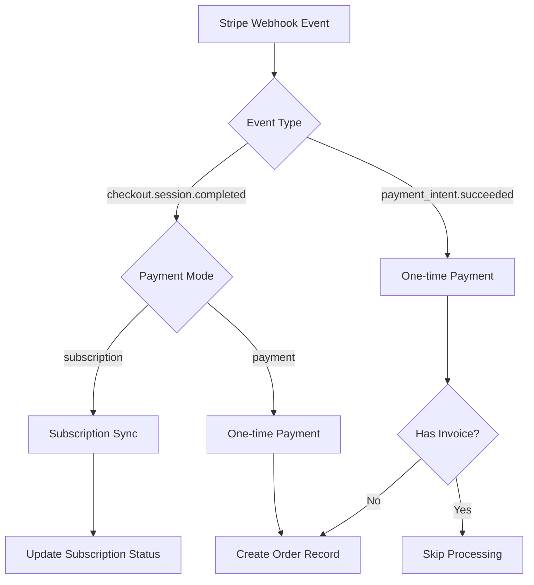

# Stripe Webhook Endpoint Documentation

## Overview

This document describes the Stripe webhook endpoint implementation in the HonestInvoice application, which handles payment and subscription events from Stripe to keep the application's billing state synchronized.

## Repository Type

**Full-Stack Application** - Frontend React SPA with Supabase backend services

## Webhook Endpoint Details

### Endpoint URL
```
https://ezdmasftbvaohoghiflo.supabase.co/functions/v1/stripe-webhook
```

### Request Method
- **POST** - Receives webhook events from Stripe
- **OPTIONS** - CORS preflight support

### Authentication & Security
- **Webhook Signature Verification**: Uses `stripe-signature` header with webhook secret
- **Environment Variables Required**:
  - `STRIPE_SECRET_KEY`: Stripe API secret key
  - `STRIPE_WEBHOOK_SECRET`: Webhook endpoint secret for signature verification
  - `SUPABASE_URL`: Supabase project URL
  - `SUPABASE_SERVICE_ROLE_KEY`: Service role key for database operations

## Architecture

### Function Location
```
supabase/functions/stripe-webhook/index.ts
```

### Technology Stack
- **Runtime**: Supabase Edge Functions (Deno)
- **Stripe SDK**: `stripe@17.7.0`
- **Supabase Client**: `@supabase/supabase-js@2.49.1`

## Webhook Event Processing

### Supported Event Types



### Event Handling Logic

| Event Type | Mode | Action |
|------------|------|--------|
| `checkout.session.completed` | `subscription` | Sync customer subscription from Stripe |
| `checkout.session.completed` | `payment` | Create order record in database |
| `payment_intent.succeeded` | One-time (no invoice) | Create order record in database |
| `payment_intent.succeeded` | Invoice payment | Skip processing |

## Data Flow

### Subscription Events
1. Extract customer ID from webhook event
2. Fetch latest subscription data from Stripe API
3. Upsert subscription record in `stripe_subscriptions` table
4. Update payment method information if available

### One-time Payment Events
1. Extract payment session details
2. Insert order record into `stripe_orders` table
3. Store payment intent, amounts, and status

## Database Integration

### Tables Updated

#### stripe_subscriptions
```sql
{
  customer_id: string,
  subscription_id: string,
  price_id: string,
  current_period_start: timestamp,
  current_period_end: timestamp,
  cancel_at_period_end: boolean,
  payment_method_brand: string,
  payment_method_last4: string,
  status: string
}
```

#### stripe_orders
```sql
{
  checkout_session_id: string,
  payment_intent_id: string,
  customer_id: string,
  amount_subtotal: number,
  amount_total: number,
  currency: string,
  payment_status: string,
  status: string
}
```

## Security Implementation

### Signature Verification Process
```typescript
const signature = req.headers.get('stripe-signature');
const body = await req.text();

try {
  event = await stripe.webhooks.constructEventAsync(
    body, 
    signature, 
    stripeWebhookSecret
  );
} catch (error) {
  return new Response(
    `Webhook signature verification failed: ${error.message}`, 
    { status: 400 }
  );
}
```

### Error Handling
- **400 Bad Request**: Invalid signature or missing signature header
- **405 Method Not Allowed**: Non-POST requests (except OPTIONS)
- **500 Internal Server Error**: Processing failures

## Configuration Requirements

### Stripe Dashboard Setup
1. Configure webhook endpoint URL in Stripe Dashboard
2. Select required event types:
   - `checkout.session.completed`
   - `payment_intent.succeeded`
3. Copy webhook signing secret to environment variables

### Environment Variables
```env
STRIPE_SECRET_KEY=sk_live_...
STRIPE_WEBHOOK_SECRET=whsec_...
SUPABASE_URL=https://ezdmasftbvaohoghiflo.supabase.co
SUPABASE_SERVICE_ROLE_KEY=...
```

## Response Format

### Success Response
```json
{
  "received": true
}
```

### Error Response
```json
{
  "error": "Error message description"
}
```

## Testing Considerations

### Webhook Testing
- Use Stripe CLI for local development: `stripe listen --forward-to localhost:54321/functions/v1/stripe-webhook`
- Test signature verification with actual Stripe events
- Verify database updates after webhook processing

### Security Testing
- Validate signature verification rejects invalid signatures
- Ensure proper error handling for malformed requests
- Test CORS preflight handling

## Monitoring & Logging

### Success Indicators
- `Successfully synced subscription for customer: {customerId}`
- `Successfully processed one-time payment for session: {sessionId}`

### Error Indicators
- `Webhook signature verification failed`
- `No customer received on event`
- `Error syncing subscription`
- `Error processing one-time payment`

## Integration Points

### Frontend Integration
- No direct frontend interaction with webhook endpoint
- Webhook updates database state accessed by frontend via Supabase queries

### Database Triggers
- Subscription updates trigger Pro access validation
- Order creation enables transaction history tracking