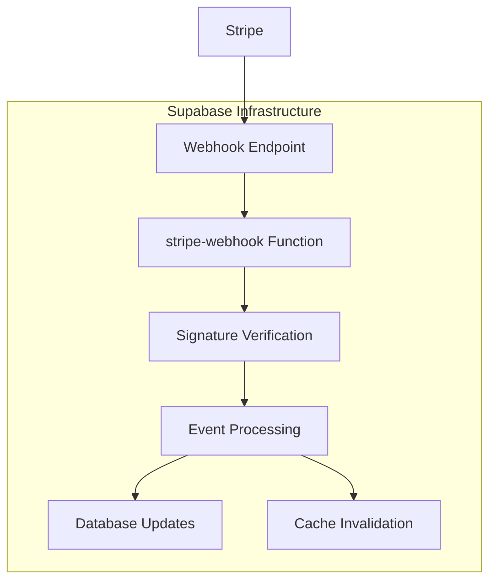
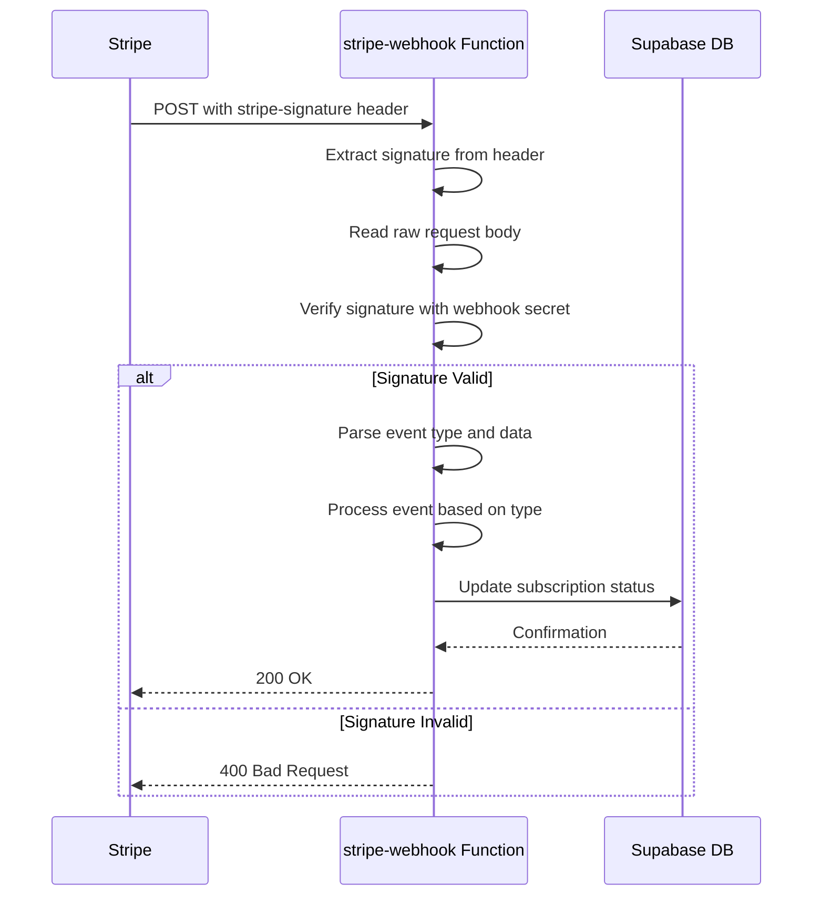

# Stripe Webhook Endpoint Setup for HonestInvoice.com

## Overview

This document outlines the proper Stripe webhook endpoint configuration for the HonestInvoice application hosted on honestinvoice.com. The webhook endpoint enables real-time synchronization of subscription status between Stripe and the application database.

## Architecture

The HonestInvoice application uses a serverless architecture with Supabase Edge Functions to handle Stripe webhooks:



## Webhook Endpoint URLs

### Production Environment (honestinvoice.com)

**Webhook Destination URL:**
```
https://ezdmasftbvaohoghiflo.supabase.co/functions/v1/stripe-webhook
```

**URL Structure Breakdown:**
- **Base Domain**: `ezdmasftbvaohoghiflo.supabase.co`
- **Functions Path**: `/functions/v1/`
- **Function Name**: `stripe-webhook`

### Development Environment

For local development and testing:
```
https://ezdmasftbvaohoghiflo.supabase.co/functions/v1/stripe-webhook
```

Note: Even in development, the webhook URL points to the deployed Supabase function, not localhost, as Stripe requires a publicly accessible endpoint.

## Stripe Dashboard Configuration

### Creating the Webhook Endpoint

1. **Navigate to Stripe Dashboard**
   - Go to Developers → Webhooks
   - Click "Add endpoint"

2. **Endpoint Configuration**
   - **Endpoint URL**: `https://ezdmasftbvaohoghiflo.supabase.co/functions/v1/stripe-webhook`
   - **Description**: "HonestInvoice Subscription Sync"
   - **Version**: Latest API version

3. **Event Selection**
   Configure the webhook to listen for these specific events:
   - `checkout.session.completed`
   - `customer.subscription.created`
   - `customer.subscription.updated`
   - `customer.subscription.deleted`
   - `invoice.payment_succeeded`

### Webhook Endpoint ID

After creating the webhook endpoint in Stripe, you'll receive a webhook endpoint ID in the format:
```
we_[random_string]
```

Example: `we_1NrKjX2eZvKYlo2CabcdEfgh`

## Environment Variables Configuration

### Required Webhook Variables

```bash
# Supabase Configuration
SUPABASE_URL=https://ezdmasftbvaohoghiflo.supabase.co
SUPABASE_SERVICE_ROLE_KEY=[your-service-role-key]

# Stripe Configuration  
STRIPE_SECRET_KEY=[your-stripe-secret-key]
STRIPE_WEBHOOK_SECRET=[webhook-endpoint-signing-secret]
```

### Webhook Signing Secret

The `STRIPE_WEBHOOK_SECRET` is crucial for security:
- Format: `whsec_[random_string]`
- Found in Stripe Dashboard → Webhooks → [Your Endpoint] → Signing secret
- Used to verify webhook authenticity

## Webhook Function Implementation

### Security Features

The webhook function implements comprehensive security measures:



### Event Processing Logic

The webhook handles different event types:

| Event Type | Processing Action |
|------------|-------------------|
| `checkout.session.completed` | Determine subscription vs one-time payment and sync accordingly |
| `customer.subscription.created` | Sync new subscription data to database |
| `customer.subscription.updated` | Update existing subscription status and metadata |
| `customer.subscription.deleted` | Mark subscription as canceled |
| `invoice.payment_succeeded` | Sync latest subscription status for renewals |

## Testing and Validation

### Stripe CLI Testing

For local testing, use Stripe CLI to forward webhooks:

```bash
# Install Stripe CLI
stripe login

# Forward events to local endpoint (for development)
stripe listen --forward-to https://ezdmasftbvaohoghiflo.supabase.co/functions/v1/stripe-webhook

# Trigger test events
stripe trigger checkout.session.completed
stripe trigger customer.subscription.updated
```

### Webhook Endpoint Validation

To verify the webhook endpoint is working:

1. **Check Function Logs**
   ```bash
   supabase functions logs stripe-webhook
   ```

2. **Monitor Stripe Dashboard**
   - Navigate to Webhooks → [Your Endpoint]
   - Check "Recent deliveries" for successful responses

3. **Test Events**
   Expected log entries:
   - `Processing webhook event: checkout.session.completed`
   - `Successfully synced subscription for customer: cus_xxx`

## Error Handling and Monitoring

### Authentication Issue (401 Unauthorized)

**Problem**: Stripe webhook calls are returning 401 Unauthorized errors

**Root Cause**: The function code is correctly configured to use `SUPABASE_SERVICE_ROLE_KEY`, but the environment variable may not be properly set in the Supabase function environment.

**Current Function Configuration** (✅ CORRECT):
```typescript
const supabase = createClient(
  Deno.env.get('SUPABASE_URL')!, 
  Deno.env.get('SUPABASE_SERVICE_ROLE_KEY')!  // ✅ Using service role key
);
```

**Verification Steps**:

1. **Check if Environment Variable is Set**
   ```bash
   # List all function secrets
   supabase secrets list --project-ref ezdmasftbvaohoghiflo
   ```
   You should see `SUPABASE_SERVICE_ROLE_KEY` in the list.

2. **Get Your Service Role Key**
   - Go to Supabase Dashboard → Settings → API
   - Copy the `service_role` key (starts with `eyJ...`)
   - **NOT** the `anon` key

3. **Set the Environment Variable**
   ```bash
   # Set the service role key for the function
   supabase secrets set --project-ref ezdmasftbvaohoghiflo SUPABASE_SERVICE_ROLE_KEY=eyJ...[your-service-role-key]
   ```

4. **Verify All Required Environment Variables**
   Your function needs these four environment variables:
   ```bash
   supabase secrets set --project-ref ezdmasftbvaohoghiflo SUPABASE_URL=https://ezdmasftbvaohoghiflo.supabase.co
   supabase secrets set --project-ref ezdmasftbvaohoghiflo SUPABASE_SERVICE_ROLE_KEY=[your-service-role-key]
   supabase secrets set --project-ref ezdmasftbvaohoghiflo STRIPE_SECRET_KEY=[your-stripe-secret-key]
   supabase secrets set --project-ref ezdmasftbvaohoghiflo STRIPE_WEBHOOK_SECRET=[your-webhook-signing-secret]
   ```

5. **Redeploy the Function**
   ```bash
   supabase functions deploy stripe-webhook --project-ref ezdmasftbvaohoghiflo
   ```

### Retry Logic

The webhook function implements exponential backoff retry logic:
- Maximum 3 retry attempts
- Exponential delay: 1s, 2s, 4s
- Comprehensive error logging

### Monitoring Metrics

Key metrics to monitor:
- **Webhook Success Rate**: Should be >99%
- **Processing Time**: Average <2 seconds
- **Event Processing**: All critical events processed successfully

### Common Issues and Solutions

| Issue | Cause | Solution |
|-------|-------|----------|
| 401 Unauthorized | Missing/wrong service role key | Set `SUPABASE_SERVICE_ROLE_KEY` in function environment |
| 400 Signature Invalid | Wrong webhook secret | Verify `STRIPE_WEBHOOK_SECRET` matches Stripe dashboard |
| Customer mapping not found | Missing user metadata | Ensure Stripe customers have `userId` in metadata |
| Timeout errors | Database performance | Check database connection and query performance |

## Debugging 401 Unauthorized Errors

### Quick Fix Command Sequence

If you have your service role key ready, run these commands:

```bash
# 1. Set the service role key (replace with your actual key)
supabase secrets set --project-ref ezdmasftbvaohoghiflo SUPABASE_SERVICE_ROLE_KEY=eyJ...[your-actual-service-role-key]

# 2. Verify it was set
supabase secrets list --project-ref ezdmasftbvaohoghiflo

# 3. Redeploy the function
supabase functions deploy stripe-webhook --project-ref ezdmasftbvaohoghiflo

# 4. Test with Stripe CLI
stripe trigger checkout.session.completed
```

### Alternative: Using Supabase Dashboard

1. **Go to Supabase Dashboard**
   - Navigate to Edge Functions → stripe-webhook
   - Click on "Settings" tab

2. **Add Environment Variables**
   ```
   SUPABASE_SERVICE_ROLE_KEY = [your-service-role-key-from-api-settings]
   STRIPE_SECRET_KEY = [your-stripe-secret-key]
   STRIPE_WEBHOOK_SECRET = [your-webhook-signing-secret-from-stripe]
   ```

3. **Deploy Function**
   - Click "Deploy" button in the dashboard
   - Or use CLI: `supabase functions deploy stripe-webhook`

### Expected Results After Fix

**✅ Success Indicators:**
- Webhook returns `200 OK` instead of `401 Unauthorized`
- Stripe dashboard shows successful webhook deliveries
- Function logs show: `"Processing webhook event: checkout.session.completed"`
- Database records are created/updated successfully

**❌ If Still Getting 401:**
- Double-check the service role key is correct (starts with `eyJ`)
- Ensure you're using the service role key, not the anon key
- Verify the environment variable name is exactly `SUPABASE_SERVICE_ROLE_KEY`
- Try deleting and recreating the environment variable

## Production Checklist

- [ ] Webhook endpoint created in Stripe dashboard
- [ ] Correct endpoint URL configured: `https://ezdmasftbvaohoghiflo.supabase.co/functions/v1/stripe-webhook`
- [ ] All required events selected in Stripe webhook configuration
- [ ] **CRITICAL**: `SUPABASE_SERVICE_ROLE_KEY` set in function environment
- [ ] `STRIPE_SECRET_KEY` configured in function environment
- [ ] `STRIPE_WEBHOOK_SECRET` configured and matches Stripe dashboard
- [ ] Function code uses service role key (not anon key)
- [ ] Function deployed and accessible
- [ ] Test webhook events return 200 OK (not 401)
- [ ] Error handling and retry logic verified
- [ ] Monitoring and logging configured