# Stripe Integration Test Suite

A comprehensive testing framework for validating all components of the HonestInvoice Stripe integration system.

## Overview

This test suite ensures proper functionality across database schemas, Supabase Edge Functions, webhook validation, subscription synchronization, and Pro feature access control for the HonestInvoice application.

## Test Architecture

```mermaid
graph TD
    A[Test Suite Entry Point] --> B[Database Component Tests]
    A --> C[Environment Configuration Tests]
    A --> D[Stripe Setup Tests]
    A --> E[Supabase Function Tests]
    A --> F[Webhook Validation Tests]
    A --> G[Subscription Flow Tests]
    A --> H[Pro Access Control Tests]
    A --> I[End-to-End Integration Tests]
    
    B --> B1[Schema Verification]
    B --> B2[RLS Policy Testing]
    B --> B3[Custom Functions Testing]
    
    C --> C1[Local Environment Validation]
    C --> C2[Supabase Environment Validation]
    C --> C3[Stripe Configuration Validation]
    
    D --> D1[Pro Product Creation]
    D --> D2[Feature Entitlements Setup]
    D --> D3[Price Configuration]
    
    E --> E1[stripe-checkout Function]
    E --> E2[stripe-webhook Function]
    E --> E3[Function Authentication]
    
    F --> F1[Signature Verification]
    F --> F2[Event Processing]
    F --> F3[Error Handling]
    
    G --> G1[Status Synchronization]
    G --> G2[Cache Invalidation]
    G --> G3[Pro Access Control]
    
    H --> H1[Access Control Logic]
    H --> H2[Frontend Integration]
    H --> H3[Feature Gating]
    
    I --> I1[Complete Checkout Flow]
    I --> I2[Feature Activation]
    I --> I3[User Experience Validation]
```



## Quick Start

### Prerequisites

1. **Environment Setup**: Ensure all required environment variables are configured
2. **Dependencies**: Install all npm dependencies (`npm install`)
3. **Supabase**: Have Supabase project set up with proper permissions
4. **Stripe**: Configure Stripe account with test API keys

### Running Tests

```bash
# Run complete test suite
npm run test:stripe

# Run with verbose output
npm run test:stripe:verbose

# Run only critical tests
npm run test:stripe:critical

# Run individual test suites
npm run test:database       # Database components
npm run test:environment    # Environment configuration
npm run test:stripe-setup   # Stripe product setup
npm run test:functions      # Supabase Edge Functions
npm run test:webhooks       # Webhook validation
npm run test:sync          # Subscription synchronization
npm run test:access        # Pro access control
npm run test:e2e           # End-to-end integration
```

## Test Suites

### 1. Database Component Tests (`test-database-components.js`)
- **Schema Verification**: Validates all Stripe-related database tables
- **RLS Policy Testing**: Confirms Row Level Security policies
- **Custom Functions**: Tests database functions and triggers

**Test ID: DB-001, DB-002, DB-003**

### 2. Environment Configuration Tests (`test-environment-config.js`)
- **Local Environment**: Validates local environment variables
- **Supabase Environment**: Tests Supabase function configuration
- **Stripe Configuration**: Verifies Stripe API configuration

**Test ID: ENV-001, ENV-002, ENV-003**

### 3. Stripe Setup Tests (`test-stripe-setup.js`)
- **API Connectivity**: Tests Stripe API access
- **Product Creation**: Validates HonestInvoice Pro product setup
- **Feature Entitlements**: Tests feature configuration

**Test ID: STRIPE-001, STRIPE-002**

### 4. Supabase Function Tests (`test-supabase-functions.js`)
- **Checkout Function**: Tests `stripe-checkout` Edge Function
- **Webhook Function**: Tests `stripe-webhook` Edge Function
- **Authentication**: Validates function security

**Test ID: FUNC-001, FUNC-002**

### 5. Webhook Validation Tests (`test-webhook-validation.js`)
- **Signature Verification**: Tests webhook signature validation
- **Event Processing**: Validates event handling logic
- **Error Handling**: Tests error scenarios and retry logic

**Test ID: WEBHOOK-001, WEBHOOK-002**

### 6. Subscription Synchronization Tests (`test-subscription-sync.js`)
- **Status Synchronization**: Tests Stripe-Supabase data sync
- **Cache Invalidation**: Validates cache management
- **Real-time Updates**: Tests immediate synchronization

**Test ID: SYNC-001, SYNC-002**

### 7. Pro Access Control Tests (`test-pro-access-control.js`)
- **Access Logic**: Tests subscription status access rules
- **Frontend Integration**: Validates React hook integration
- **Feature Gating**: Tests ProFeatureGate component

**Test ID: ACCESS-001, ACCESS-002**

### 8. End-to-End Integration Tests (`test-e2e-integration.js`)
- **Complete Flow**: Tests full subscription flow
- **Feature Activation**: Validates immediate Pro access
- **User Experience**: Tests seamless upgrade process

**Test ID: E2E-001, E2E-002, E2E-003**

## Required Environment Variables

### Local Development (.env)
```bash
# Supabase Configuration
VITE_SUPABASE_URL=https://your-project.supabase.co
VITE_SUPABASE_ANON_KEY=your-anon-key

# Stripe Configuration
VITE_STRIPE_PUBLISHABLE_KEY=pk_test_your-publishable-key
VITE_STRIPE_PRO_PRICE_ID=price_your-pro-price-id
STRIPE_SECRET_KEY=sk_test_your-secret-key
STRIPE_WEBHOOK_SECRET=whsec_your-webhook-secret
```

### Supabase Environment Variables
Configure in Supabase Dashboard → Project Settings → Edge Functions → Environment Variables:
```bash
STRIPE_SECRET_KEY=sk_test_your-secret-key
STRIPE_WEBHOOK_SECRET=whsec_your-webhook-secret
SUPABASE_URL=https://your-project.supabase.co
SUPABASE_SERVICE_ROLE_KEY=your-service-role-key
```

## Test Results Interpretation

### Success Indicators
- ✅ **GREEN**: Test passed successfully
- ⚠️ **YELLOW**: Warning or non-critical issue
- ❌ **RED**: Critical failure requiring attention

### Critical vs Non-Critical Tests
- **Critical**: Database, Environment, Stripe Setup (must pass for production)
- **Non-Critical**: Functions, Webhooks, Sync, Access, E2E (recommended to pass)

### Exit Codes
- `0`: All tests passed successfully
- `1`: One or more tests failed

## Troubleshooting

### Common Issues

#### Database Schema Errors
```bash
# Fix: Run database migrations
supabase db reset --linked

# Or apply specific SQL scripts
# Run scripts/fix-stripe-subscriptions-table.sql in Supabase SQL Editor
```

#### Environment Variable Issues
```bash
# Fix: Create/update .env file
cp .env.example .env
# Edit .env with your actual values
```

#### Stripe Setup Issues
```bash
# Fix: Configure Stripe secret key and run setup
export STRIPE_SECRET_KEY=sk_test_your_key
npm run test:stripe-setup
```

#### Function Deployment Issues
```bash
# Fix: Deploy Supabase Edge Functions
supabase functions deploy
```

#### Webhook Configuration Issues
```bash
# Fix: Set up webhook endpoint in Stripe Dashboard
# URL: https://your-project.supabase.co/functions/v1/stripe-webhook
# Events: checkout.session.completed, customer.subscription.*
```

### Debugging Tips

1. **Use Verbose Mode**: `npm run test:stripe:verbose` for detailed output
2. **Run Individual Tests**: Test specific components in isolation
3. **Check Logs**: Monitor Supabase function logs for errors
4. **Verify Environment**: Ensure all environment variables are set correctly
5. **Test Incrementally**: Run critical tests first, then non-critical

## Integration with CI/CD

### GitHub Actions Example
```yaml
name: Stripe Integration Tests
on: [push, pull_request]

jobs:
  test-stripe-integration:
    runs-on: ubuntu-latest
    steps:
      - uses: actions/checkout@v3
      - uses: actions/setup-node@v3
      - run: npm install
      - run: npm run test:stripe:critical
    env:
      VITE_SUPABASE_URL: ${{ secrets.SUPABASE_URL }}
      VITE_SUPABASE_ANON_KEY: ${{ secrets.SUPABASE_ANON_KEY }}
      STRIPE_SECRET_KEY: ${{ secrets.STRIPE_SECRET_KEY }}
```

## Monitoring and Alerting

### Production Monitoring
- Set up webhook delivery monitoring in Stripe Dashboard
- Monitor Supabase function execution logs
- Track subscription synchronization latency
- Alert on failed webhook processing

### Health Checks
```bash
# Regular health check script
npm run test:stripe:critical
```

## Contributing

When adding new features to the Stripe integration:

1. **Add Tests**: Create corresponding test cases
2. **Update Suite**: Add new tests to the master test suite
3. **Document**: Update this README with new test information
4. **Validate**: Ensure all tests pass before merging

## Support

For issues with the test suite:

1. Check the troubleshooting section above
2. Review Supabase and Stripe documentation
3. Check environment variable configuration
4. Verify database schema and migrations

## License

This test suite is part of the HonestInvoice project and follows the same license terms.